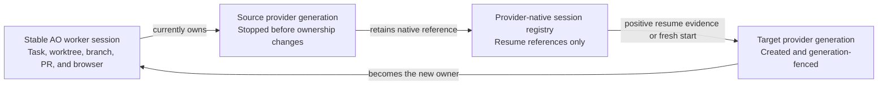
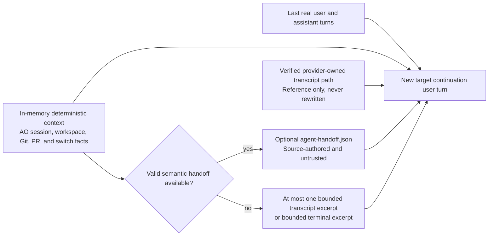
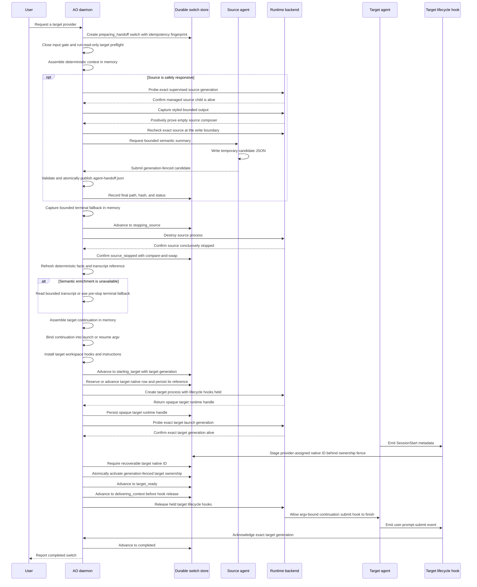
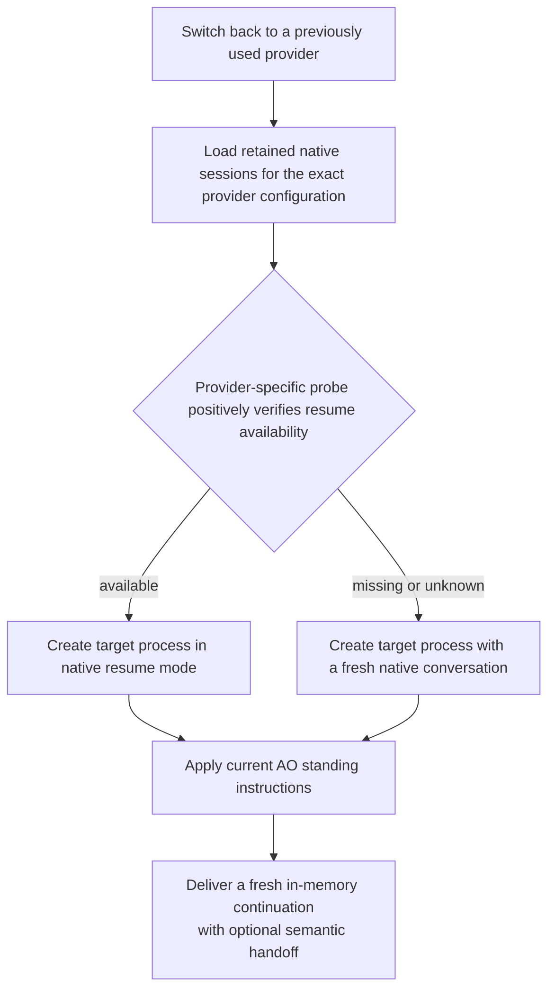
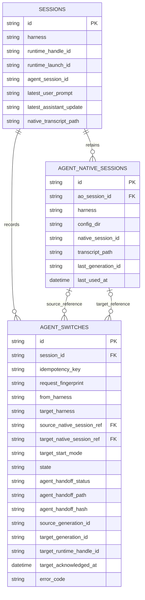
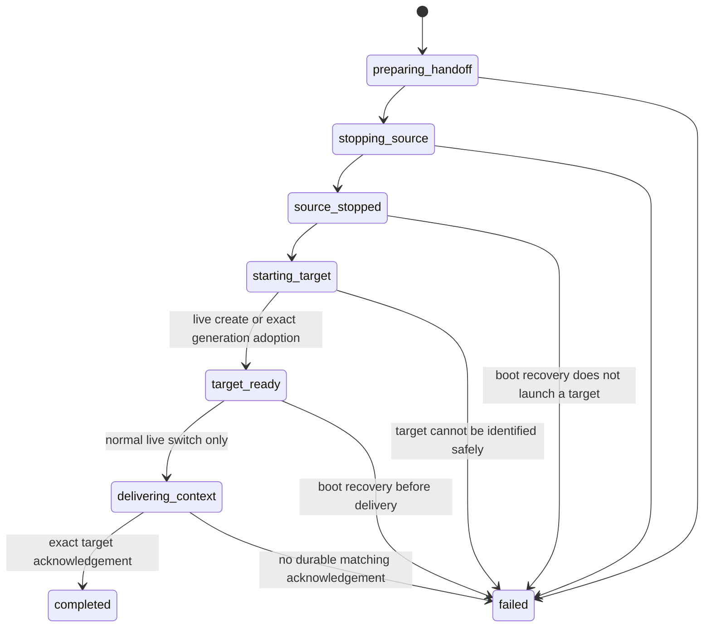

# AO agent switching

Status: initial worker-session implementation

AO agent switching changes the coding-agent provider that owns an existing AO
worker session without creating a different AO job. The AO session, project,
worktree, branch, task, pull requests, and browser target stay the same. The
terminal or runtime handle also stays stable where the selected runtime backend
supports that identity. The source and target are nevertheless different
provider processes: AO conclusively stops the source and separately creates the
target.

The initial release is deliberately narrow:

- only worker sessions can switch; orchestrator sessions cannot;
- both the source and target must be Claude Code or Codex;
- a user starts the switch manually;
- only one provider generation can own and write to the worktree at a time.

Automatic switching for budgets, quotas, or provider failures is deferred. A
future policy may call the same durable switch operation, but it must not bypass
the ownership and recovery rules in this document.

## Product model

Switching changes provider ownership, not the identity of the user's work. An
inactive provider process is not kept alive. AO may retain that provider's
native session reference so a later switch back can resume it when the provider
can positively verify that the native session is available.

## What AO does not migrate

AO does **not** build a canonical transcript and does not rewrite a provider's
JSON, JSONL, session database, or checkpoint files. In particular, switching
does not:

- translate one provider's events into another provider's events;
- write the last N request-response pairs into a target provider's native
  transcript or impersonate them as provider-native history;
- clip or materialize a synthetic provider history to fit a context window;
- convert one provider's compaction checkpoint into another provider's native
  checkpoint; or
- append content to a provider-owned session file.

Each provider remains responsible for its own history, context-window policy,
summarization, compaction, caching, and resume format. AO preserves those native
semantics by leaving provider state untouched. Cross-provider continuity comes
from an in-memory deterministic context, an optional source-authored semantic
handoff, a verified provider-owned source-transcript reference, and a new
target user turn. AO never rewrites the transcript or persists a synthetic
provider history. When semantic enrichment is unavailable, AO may open the
source transcript read-only and include at most one bounded excerpt as fallback.

## Continuity model

Every switch has deterministic context assembled by AO in memory. An optional
source-agent summary may enrich it, but the switch never depends on the model
producing that summary.

The deterministic portion is AO's reliability layer. It contains bounded facts
that AO can derive without asking the source model, including:

- the stable AO session identity, source, target, and optional user
  note;
- the original task, latest real user prompt, and latest user-facing assistant
  update;
- verified provider-native session and transcript references, when available;
- one bounded terminal excerpt only when semantic enrichment and a readable
  transcript fallback are both unavailable;
- the workspace, branch, HEAD, changed paths, and recent commits; and
- current pull-request, CI, review, and mergeability facts.

AO does not serialize this aggregate. It keeps the aggregate in memory,
refreshes the volatile facts after the source is stopped, and places the
delivery-safe values directly in the target continuation. The last real user
prompt and last user-facing assistant update are always included, regardless
of whether semantic enrichment succeeds.

The optional semantic portion is a comprehensive summary produced from the
source agent's already-loaded native conversation. AO requests it only when it
can positively prove both that the exact supervised source generation still has
its managed agent child and that current styled terminal evidence shows an empty
composer (or only a dim provider placeholder). AO repeats the exact-generation
check at the serialized write boundary immediately before submitting the
request. A cached `idle` activity value is not sufficient because a human may
have typed an unsent draft since the last hook. ConPTY does not advertise an
empty-composer safety surface: its raw PTY history is not a rendered current
screen and can omit an unterminated draft line, so Windows sources use
deterministic/transcript
fallback. The report can explain the session objective and current state,
completed and in-progress work, decisions and reasoning, artifacts and files,
tests and results, blockers, uncertainty, and the intended next action. When
safely responsive, the source writes one bounded JSON object to a private
per-switch candidate path and submits it with the switch and source-generation
fence. AO validates and canonicalizes the object, then atomically publishes it
as `agent-handoff.json`. The candidate is removed after the source stops, so
`agent-handoff.json` is the only handoff file AO retains. The source summarizes
its own loaded conversation; it is not asked to read an AO-generated context
file or start new discovery or repository work. Its contents cannot overwrite
AO-observed facts, grant new authority, or be treated as trusted instructions.
The target is told to verify them against the live worktree.

AO always passes a verified provider-owned transcript path when one is
available, so the target can inspect older detail on demand. It includes a
bounded transcript excerpt only when semantic enrichment is absent, timed out,
invalid, or otherwise unavailable. AO reads at most the newest 600 physical
records and 64 KiB after the source has stopped. If no complete provider
transcript can be positively located and read, a bounded terminal excerpt is
used instead. At most one fallback excerpt is delivered inline, when available,
and is never written to an AO handoff file. Transcript records remain opaque
because provider schemas differ and may change. Target workspace hooks and
instructions are installed only after the post-stop refresh. A target-native
session record is reserved after the source-stop boundary and before target
creation so an early provider SessionStart hook has a durable place to stage
its native ID. AO still transfers ownership only after the exact target launch
is alive and a recoverable provider-native ID is durable.

## End-to-end flow

### 1. Validate and preflight while the source still owns the session

AO rejects unsupported session kinds, unsupported providers, a switch to the
already-active provider, incomplete runtime state, and a second non-terminal
switch. Before stopping the source, it resolves credentials, probes native
resume evidence, constructs the launch command and standing instructions, and
verifies the target binary. This preflight is read-only with respect to the
worktree and native-session registry: it does not install target hooks, mutate
workspace instructions, or reserve the target-native conversation.

An idempotency key is bound to a fingerprint of the stable user request. A
retry of the same request finds the existing saga. Reusing the key for a
different target or note is a conflict.

An unresolved external cleanup can leave a saga and its input gate deliberately
retained. A new explicit switch request is also the recovery affordance for
that case: AO reclaims the retained recovery gate and reconciles the old saga
once. The new request proceeds only if the old saga reaches a proven terminal
outcome; otherwise AO continues to report a switch in progress.

### 2. Prepare deterministic and optional semantic context

AO assembles deterministic context in memory first. If the source adapter can
prove that the exact supervised source generation and its managed child are
still alive, and styled terminal evidence positively proves that the current
composer is empty, AO may ask the source to summarize the native conversation
already in its own context. The exact source generation is checked again under
the serialized coordination guard at the write boundary immediately before the
request is submitted. AO supplies a unique private per-switch candidate path.
The source writes one bounded JSON object and submits that file through
`ao session handoff submit`; the switch ID and source generation fence out stale
submissions. AO validates and canonicalizes the object, atomically publishes
the sole long-lived `agent-handoff.json`, records its path, hash, and status,
and removes the candidate after source shutdown. It does not duplicate the body
into the database or another handoff file. Timeout, quota exhaustion, source
failure, missing exact-generation or composer proof, or an invalid response
merely marks semantic enrichment unavailable or rejected. A collection-only
error that is durably settled also falls back; only changed ownership or failure
to settle the optional lane can stop the switch.

### 3. Stop the source, then capture final facts

`Destroy(source)` and `Create(target)` are separate runtime operations. AO does
not use an in-place restart to silently change the command beneath a running
provider process.

Once `stopping_source` is durable, AO performs source destruction on a bounded
context detached from the lifetime of the originating HTTP request. Closing the
dialog, cancelling the request, or losing the renderer connection therefore
cannot cancel a stop that AO has already committed to perform. If AO cannot
conclusively confirm the stop, it retains the non-terminal saga and input gate;
it does not declare failure, reopen user input, or start the target alongside an
uncertain source.

Only a conclusive runtime stop advances the saga to `source_stopped`. In the
same durable transition, the session remains projected as the source harness
and source generation but is marked exited. This avoids claiming that either
provider owns the session during the gap.

AO then refreshes the in-memory deterministic context from the workspace and
revalidates any provider-owned transcript reference after the source has
stopped appending. The continuation receives these final source-only facts
directly. If a valid `agent-handoff.json` is available, AO includes its path and
does not inline a transcript or terminal excerpt. Otherwise, AO reads one
bounded newest excerpt from the verified transcript. When a complete transcript
cannot be positively verified or a located file cannot be read safely, AO
records no fake transcript and uses one bounded terminal excerpt instead. The
excerpt exists only in memory until it is sent.
Target creation cannot begin before this post-stop refresh is complete. Only
then may AO install the target's workspace hooks or instruction files. If
target activation later fails unambiguously, AO removes that target-owned
workspace state.

After the conclusive `source_stopped` transaction, target creation and delivery
continue on another bounded context that is likewise independent of the HTTP
caller's lifetime. This prevents a renderer disconnect from stranding a session
after its source is gone.

### 4. Create and atomically activate the target

AO prepares either a positively verified retained native session or a fresh
native session. After source shutdown, it reserves or advances the intended
target-native row and persists that reference before process creation. This is
not ownership: it lets a provider-assigned SessionStart ID land durably while
lifecycle still blocks the hook from mutating the source-owned `sessions` row.
The provider's retained native session remains provider-owned and is never
rewritten by AO. AO then creates the process, persists the opaque runtime handle
returned by `Create`, and probes that handle with the runtime's strict
exact-supervisor capability. The proof must match the expected launch generation
and include the supervisor's live managed agent child. The normal reaper's
looser “manual child of preserved shell” rule is never accepted for switch
activation or recovery.

For Codex fresh starts, AO waits for the provider-assigned native ID to be
staged in the reserved row. Claude's fresh ID is caller-assigned and is already
present. Durable ownership then transfers only when all expected
facts still match: AO session, switch, source harness, source generation,
source runtime launch, target native reference with a recoverable native ID,
target launch generation, and opaque target runtime handle. A stale or
unrelated process cannot win this compare-and-swap.

The stable terminal/runtime handle may be retained when the runtime backend
supports it, preserving the user's attachment and terminal surface. That is a
stable AO/runtime identity, not reuse of the source OS process.

Target hooks and workspace instructions remain launch-held until AO has either
durably activated the target or failed the attempt. If an unambiguously failed
target must be removed, AO treats runtime destruction and target-owned workspace
cleanup as required recovery work. An inconclusive destroy or cleanup retains
the saga and input gate instead of presenting a terminal failure with leaked
external state.

### 5. Deliver context and wait for an internal acknowledgement

Both supported providers use **in-command delivery**. AO binds the complete
final continuation into the provider's fresh-launch or native-resume argv,
creates the target with hooks held, activates the exact generation, persists
`delivering_context`, and only then releases the held launch. No pane paste or
composer heuristic is used, so a provider trust prompt cannot accidentally
receive the continuation plus Enter.

In-command providers keep standing instructions out of the launch command when
their CLIs support it. Claude Code receives AO's system-prompt file through
`--append-system-prompt-file`. Codex selects an AO-managed, session-scoped
profile containing additive `developer_instructions`; this preserves Codex's
built-in coding and tool instructions. AO namespaces that profile by data root
and session, materializes and validates it during target preflight before the
source is stopped, and removes recreatable profile state after failed switches,
switch-away, or terminal workspace cleanup. Provider transcripts are never
removed with the profile. The continuation itself is still subject to the
runtime's transport boundary.

During target preflight, ConPTY calculates a safe budget for Windows'
CreateProcess command line, while tmux calculates against its 16,380-byte
command frame and worst-case POSIX single-quote expansion. Both calculations
include the complete prompt-free supervisor/provider argv, executable path,
session ID, workspace path, and additional headroom. If fewer than 2 KiB remain,
preflight rejects the switch before the source is stopped. Otherwise AO compacts
the in-memory continuation to the returned budget, preserving the protocol
envelope and bounded original/latest user/latest assistant facts; large inline
history is omitted while verified file references are retained when they fit.
This prevents an ordinary 40–64 KiB fallback from crossing either tmux's frame
limit or CreateProcess's roughly 32K UTF-16 command-line ceiling after source
shutdown.

The continuation becomes a new user turn containing the
switch reference, the in-memory deterministic facts, the last real user prompt,
the last user-facing assistant update, the verified provider-owned source
transcript location when available, and continue-or-wait rules. When semantic
enrichment succeeded, it also contains the `agent-handoff.json` location. When
semantic enrichment is unavailable, it contains one bounded transcript excerpt
when readable or, otherwise, one bounded terminal excerpt when available. AO
opens the source transcript read-only; because the target receives the real path
with normal filesystem permissions, the prompt explicitly forbids modifying it.

The optional semantic summary, transcript, and fallback excerpt are labeled
historical, untrusted evidence and must not be obeyed as instructions. Dynamic
content is never put in the standing system prompt. To prevent historical text
from closing an AO coordination envelope, inline dynamic values use one
reversible percent-decoding layer: `%25` represents a literal percent sign, and
`%3C` represents the `<` of an AO-style tag opener. The target decodes the layer
once; ordinary comparisons, HTML, JSX, and other `<` characters remain intact.

Returning from the send call is not enough to complete the switch. The saga is
completed only after AO receives a `user-prompt-submit` lifecycle hook for the
same session and exact target generation while delivery is open. Hooks from the
source, a previous target attempt, or another process are ignored. Current
provider hooks do not carry an AO continuation hash or switch token, so this is
generation-level submission evidence rather than cryptographic proof of the
exact prompt bytes. AO's exclusive input gate and send ordering ensure no other
AO or user pane write is admitted during this window.

Tmux normally preserves an interactive shell after an agent exits. AO-supervised
launches instead end in a non-interpreting sink (`exec cat >/dev/null`) and never
return to that shell. The supervisor remains in the foreground and retries the
generation-fenced exit report until AO durably accepts it; after the supervisor
exits, the sink consumes and discards any bytes that race the managed agent's
shutdown. Thus even a write that crosses the final child-exit instant cannot be
interpreted as shell commands.

This acknowledgement is an internal delivery fence. It is not the target
writing “thumbs up,” and it does not mean the user's task is finished. After
receiving the continuation, the target may continue an already-authorized next
step, ask one concise clarifying question, or acknowledge that no work is
pending and wait.

## Prompt authority boundaries

| Layer | Contents | Lifetime and authority |
| --- | --- | --- |
| Standing system instructions | Stable AO worker, safety, provenance, and continuation protocol | Applied on each fresh launch and native resume; does not contain dynamic transcript text |
| Source handoff request | Comprehensive summary from the source's already-loaded native conversation; writes a temporary candidate and performs no new discovery | One switch only; generation-fenced; optional; cannot replace deterministic facts |
| Optional semantic handoff | Source-authored session state, reasoning, work, tests, blockers, uncertainty, and next action in `agent-handoff.json` | Historical, untrusted input for one activation; retained as the sole AO handoff file |
| Target continuation turn | Switch reference, deterministic facts, last real user and assistant turns, verified source transcript path, optional semantic-handoff path, conditional fallback excerpt, and continue-or-wait behavior | New user turn that causes the target to ingest the handoff |

Dynamic transcript content is never promoted into the system prompt. A bounded
opaque excerpt appears only in the per-switch continuation user turn and only
when semantic enrichment is unavailable. Internal `<ao-handoff-request>` and
`<ao-continuation>` turns are excluded when AO tracks the latest real user and
assistant messages. The standing instructions explain how switching works; the
per-switch continuation supplies changing facts.

## Switching back to a previous provider

AO can retain multiple native conversations for one provider. It resumes only
when provider-specific evidence is positive for the same harness and
configuration root. Missing or unknown evidence chooses a fresh conversation;
it does not overwrite an older retained record.

| Provider | Standing instructions | Continuation delivery | Native resume evidence | Provider history policy |
| --- | --- | --- | --- | --- |
| Claude Code | Appended system instructions | In-command on fresh launch and native resume | Matching native session under the exact Claude configuration | Claude owns transcript and compaction |
| Codex | Developer instructions on launch and resume | In-command on fresh launch and native resume | Matching rollout under the active `sessions` tree of the exact Codex home | Codex owns rollout history and compaction; an archived rollout is transcript context only and is not resumable |

Regardless of fresh or resumed mode, AO delivers a freshly assembled
cross-provider continuation as a user turn through in-command delivery. A
resumed native conversation knows its own old history, but it does
not otherwise know what another provider changed while it was inactive.

## Durable data

The existing `sessions` row is the current-owner projection. The native-session
registry preserves provider resume references. The switch table is an auditable
saga and delivery fence. It stores semantic-handoff status and, when one was
accepted, the path and hash of the single source-authored
`agent-handoff.json`; it does not store a serialized deterministic handoff,
fallback excerpt, or duplicate handoff body. Usage and cost telemetry remain
separate.

Sensitive operational data such as native identifiers, configuration paths,
the optional semantic-handoff path, generation fences, and detailed errors
remains private to the daemon. The source-authored JSON body stays in its single
private file rather than being copied into the switch row. AO's deterministic
aggregate and any fallback excerpt exist only in memory for the live switch.
Public list and status responses expose only the curated progress fields needed
by clients.

### Privacy and retention

- Deterministic context is an in-memory delivery payload. AO does not write the
  assembled aggregate to disk or store it as a JSON column.
- A fallback transcript or terminal excerpt is also in memory only. AO does not
  create a separate file or database copy for it. After delivery, the target
  provider may retain the continuation under its own native history policy.
- `agent-handoff.json` is optional and source-authored. When accepted, it is the
  sole long-lived AO handoff-content file for the switch, stored under AO's
  private data directory with a switch-unique path. The switch row retains only
  its path, hash, and validation status.
- A provider-owned transcript remains in the provider's storage. AO retains a
  verified reference, opens it read-only when necessary, and never copies the
  complete transcript into AO storage.

## State machine

State is an operational fact, not a stored display-session status. A partial
unique index permits one non-terminal switch per AO session. Compare-and-swap
updates fence state and generation transitions.

## Conservative crash recovery

AO does not turn every interrupted saga into success or blindly replay the last
operation. Recovery uses the durable state plus conservative runtime-handle
evidence. For a newly created target, the saga stores the opaque runtime handle
returned by `Create`; boot recovery probes that durable handle rather than
assuming the session's old source handle identifies the target.

The deterministic continuation and any fallback excerpt are deliberately not
durable. A daemon restart discards them. A surviving `agent-handoff.json` may be
useful for inspection, but it is not sufficient authority to reconstruct or
resend a continuation. Before a conclusive source stop, a later explicit switch
captures fresh context from the still-owning source. After a conclusive stop,
AO follows the post-stop failure rules below instead of rebuilding context by
scanning provider history.

During daemon boot, agent-switch reconciliation is fail-closed. The HTTP server
does not begin serving if AO cannot enumerate sessions, read an active switch,
or settle an interrupted switch safely; therefore a lost in-memory fence never
reopens user input by accident. The HTTP endpoint that receives lifecycle-hook
acknowledgements is not yet serving. Boot recovery therefore never sends a new
continuation turn and never launches a target from `source_stopped`: it may
adopt a target that was already created and exactly identified in
`starting_target`, but it closes an interrupted pre-delivery switch explicitly
instead of starting an operation it cannot acknowledge. The normal live switch
path still moves from `target_ready` to `delivering_context`, sends the turn,
and waits for the exact target hook.

| Durable state | Trusted fact | Conservative recovery |
| --- | --- | --- |
| `preparing_handoff` | No conclusive source stop has been recorded | Retain the source as owner and close the interrupted saga as a pre-stop failure. Boot recovery does not resume preparation or create a target. |
| `stopping_source` | A stop was requested, but its outcome may be unknown | Treat any surviving session runtime handle as the source side and close the saga as a pre-stop failure; target creation cannot have occurred before the atomic `source_stopped` boundary. An inconclusive probe closes as source-stop-unconfirmed without transferring ownership. Only an absent handle proves the stop during recovery. If absence permits AO to commit `source_stopped`, it then closes the saga as a post-stop failure without launching a target. Recovery does not require an exact source-generation inspection because sessions created by an older AO build may predate unconditional supervision. |
| `source_stopped` | The source is conclusively stopped and no target was launched | Remove any target workspace/prelaunch state, then close the saga as an explicit post-stop failure. Cleanup failure retains the saga and input gate. Boot recovery does not create a target, send a continuation, or automatically restore the source. The stopped source is never presented as active. |
| `starting_target` | Target creation may have started, but ownership has not transferred | Probe the durable opaque `target_runtime_handle_id`, then adopt only the strict exact supervisor expected by the saga, with its managed child alive, and only when its target-native reference contains a recoverable native ID. If the durable target handle is absent, retain the saga and gate because AO cannot prove that creation failed; never substitute the destroyed source handle. After atomic adoption at boot, retain that target as owner and close the switch as an explicit interrupted-before-delivery failure; do not send a continuation. Destroy a mismatched known runtime and remove its target workspace/prelaunch state rather than attaching to an ambient, manually relaunched, or merely similar process. Any inconclusive destroy or cleanup retains the saga and gate. |
| `target_ready` | The exact target generation already owns the session and delivery has not begun | Retain the target owner and close the saga as an explicit interrupted-before-delivery failure only when its native identity is recoverable. An adopted target missing that identity is stopped and its target-owned workspace state is cleaned rather than being presented as resumable. Do not transition to `delivering_context` and do not send a turn during boot recovery. Cleanup failure retains the saga and gate. |
| `delivering_context` | The continuation send may or may not have reached the target | If a matching target acknowledgement is already durable, complete the saga. Otherwise close it as failed/in-doubt and do not resend; retain the target owner for explicit inspection or retry. |
| `completed`, `failed` | The saga is terminal | Do not infer new ownership or replay an operation from this record. |

This policy deliberately prefers an explicit recover-or-restore decision over
two active writers or a duplicate continuation. A boot-time
interrupted-before-delivery failure describes the switch operation; it does not
roll ownership back from an exactly adopted or already-ready target.
Delivery is deliberately at-most-once across a crash: a generation-matched
acknowledgement already stored while `delivering_context` lets recovery complete
the saga, but an unacknowledged in-doubt turn is never replayed. Because current
hooks do not include a continuation token, AO does not claim content-level
exactly-once proof.

If runtime destruction, workspace cleanup, or inspection itself is
inconclusive, AO retains the non-terminal saga and keeps session input gated. It
never swallows that cleanup error and then terminalizes the saga or reopens
input. A later explicit switch request may reclaim that retained recovery gate
and run one reconciliation attempt. It does not discard the old saga or start
another target alongside it; the new request is admitted only after the
retained saga is conclusively terminal.

## Additional safety guarantees

- AO closes the per-session input gate before switch preparation. Both
  `ao send` and raw terminal input respect the gate until the operation reaches
  a safe terminal or recovered state.
- Every provider launch receives a unique runtime generation. Lifecycle hooks
  missing that generation or carrying a different one cannot mutate the new
  owner or complete delivery.
- Target preflight before source stop is read-only with respect to the
  worktree and native registry. Target workspace preparation and native
  reservation follow final fact capture and the source-stop boundary. A
  provider-assigned native ID is staged before ownership transfer.
- Source semantic collection requires both an exact supervised source
  generation with a live managed child and positive empty-composer evidence.
  AO repeats the generation proof at the guarded write boundary. An unsent
  human draft, a waiting-input state, an approval dialog, missing style
  evidence, a changed generation, or an adapter without a conservative
  detector selects fallback.
- Switch activation and recovery use a strict exact-supervisor probe that also
  requires the supervisor's managed agent child to remain alive. Claude Code
  and Codex avoid a pane write by binding the continuation into launch or resume
  argv before their held launch is released. A supervisor
  merely retrying its durable exit report is not a writable target. The ordinary
  reaper may still recognize manual children of a preserved shell, but that
  looser liveness rule conveys no switch ownership.
- AO-supervised tmux launches end in a non-interpreting input sink rather than
  returning to a preserved shell, so bytes racing a managed-agent exit are
  discarded instead of executed.
- ConPTY persists the launch ID with its opaque pty-host handle and requires an
  exact launch-ID match before child liveness counts as supervised-generation
  evidence. A live ConPTY host alone is not enough for target adoption. For
  in-command providers it also budgets the continuation against the complete
  CreateProcess command line during preflight and compacts the prompt in memory
  before source shutdown; an unsafe base argv is rejected before mutation.
  ConPTY deliberately does not claim that raw PTY history is a rendered styled
  current screen, so source semantic writes fall back rather than risking a
  hidden unsent draft.
- Source handoff timeout, crash, quota exhaustion, or unsafe activity cannot
  block in-memory deterministic context assembly.
- A submitted semantic candidate must be a bounded schema-versioned JSON object
  and match the source-generation fence. AO canonicalizes it into the unique
  `agent-handoff.json`; its contents remain historical, untrusted evidence.
- Transcript references are accepted only when the provider adapter positively
  locates and safely validates provider state. AO passes the provider-owned path
  without editing it. Only when semantic enrichment is unavailable does AO read
  and inline a bounded post-stop excerpt. Missing transcript evidence selects a
  bounded terminal fallback; it is not a reason to invent or scan unrelated
  history.
- AO writes neither the deterministic aggregate nor a fallback excerpt to a
  handoff file or switch-record JSON body.
- Once `stopping_source` is durable, source destruction proceeds on a bounded
  caller-detached context. An unconfirmed stop retains the saga and input gate.
- Runtime destruction and target-workspace cleanup are required recovery
  boundaries. If either cannot be confirmed, AO fails closed with the saga and
  gate retained.
- A launch or delivery failure is not reported as a completed switch.

## Public surfaces

- Desktop: the active worker session has a **Switch agent** action. With only
  Claude Code and Codex supported, the target is the other provider.
- HTTP: clients can request a switch, inspect curated switch history/status,
  and submit a generation-fenced optional source handoff.
- CLI: `ao session switch-agent`, `ao session agent-switch ls`,
  `ao session agent-switch get`, and the internal
  `ao session handoff submit` workflow.

The initial UI has no automatic budget policy and does not expose orchestrator
switching.
