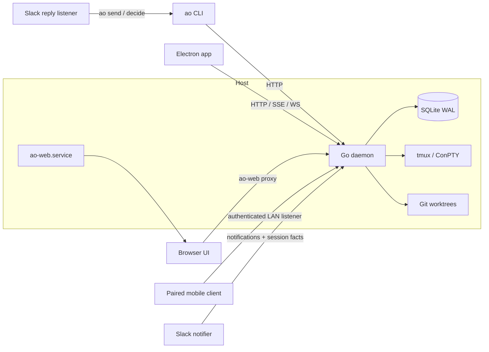
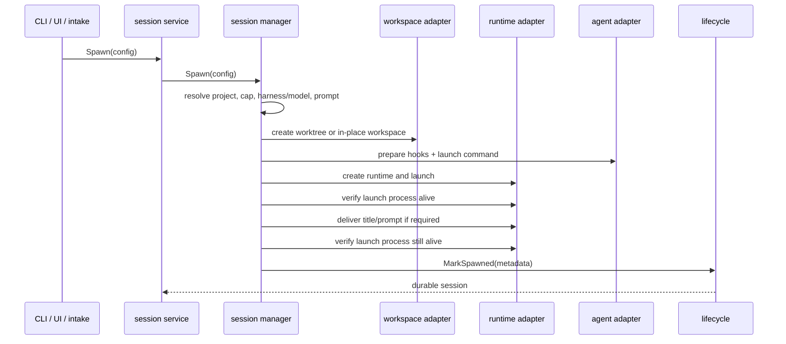

# Agent Orchestrator architecture

Status: current-state description of `main` after the July 2026 consolidation.
Technology choices live in [stack.md](stack.md); security decisions and narrow
design rationale live in [ADR](adr/) and topic documents. GitHub issues, not a
hand-maintained status page, track unfinished work.

## Mental model

Agent Orchestrator (AO) is a local control plane for coding-agent processes. A
single Go daemon owns durable state and process supervision. Clients ask the
daemon to act or read projections; they do not own lifecycle policy.

```text
external facts       durable facts             read models / actions
GitHub, runtimes  ->  SQLite + lifecycle  ->    API, CLI, UI, notifications
agent activity        reducers + CDC            supervisors, Slack transport
```

Three rules explain most of the design:

1. Persist facts, derive presentation state. A session stores activity,
   termination, identity, runtime/workspace metadata, and PR facts. Values such
   as `working`, `needs_input`, and `mergeable` are read models.
2. Observation is not authority. Pollers report GitHub, runtime, resource, and
   health facts. Lifecycle and service owners decide what those facts mean.
3. One daemon owns commands. CLI, Electron, browser, mobile, and ops sidecars
   call public HTTP/CLI surfaces instead of editing the database or terminal
   processes directly.

## Deployed topology



| Process or surface         | Owner                              | Responsibility                                                              |
| -------------------------- | ---------------------------------- | --------------------------------------------------------------------------- |
| `ao.service` / `ao daemon` | `backend/internal/daemon`          | Storage, lifecycle, sessions, observers, API, terminal mux, mobile listener |
| Electron main + renderer   | `frontend/`                        | Desktop supervision and the React client                                    |
| Browser production server  | `ops/ao-web-server.mjs`            | Static bundle and same-origin proxy to the daemon                           |
| Slack notifier             | `ops/ao-slack-notifier.mjs`        | Deliver durable notifications and current urgency to Slack                  |
| Slack reply listener       | `ops/attention-reply-listener.mjs` | Verify Slack events and route explicit replies through `ao`                 |
| Project-config drift timer | `ops/project-config*`              | Compare/apply committed project config through the CLI                      |
| Deploy driver              | `ops/deploy.sh`                    | Build, restart, and verify the local services                               |

The daemon's primary listener is loopback-only. Connect Mobile can explicitly
enable a second authenticated LAN listener over the same router; see
[ADR 0001](adr/0001-lan-listener-for-mobile.md). The browser service is the
remote web boundary and relies on its configured origin/tailnet controls.

## Composition root

`backend/internal/daemon/daemon.go` is wiring, not a policy layer. Startup builds
the graph in this order:

1. load process configuration and reject a genuinely live prior daemon;
2. open SQLite and start change-data capture (CDC);
3. select the runtime adapter and build terminal streaming;
4. build notification read/write surfaces and lifecycle/reaper;
5. build SCM observation, session manager/service, review, and tracker intake;
6. start pause drain, preview, health, model, metrics, and role supervisors;
7. mount the HTTP router and optional mobile LAN listener;
8. reconcile crash-surviving sessions before serving;
9. serve until shutdown, then cancel and join background loops in dependency
   order.

The composition root may adapt interfaces and establish shutdown ordering. New
business decisions belong in the owner packages below.

## Ownership map

| Concern                       | Canonical owner            | Boundary                                                            |
| ----------------------------- | -------------------------- | ------------------------------------------------------------------- |
| Shared vocabulary and records | `internal/domain`          | Types and pure rules; no I/O                                        |
| External contracts            | `internal/ports`           | Narrow interfaces consumed by core code                             |
| Session commands              | `internal/session_manager` | Spawn, restore, kill, switch, send, workspace/runtime orchestration |
| Durable lifecycle facts       | `internal/lifecycle`       | Reduce activity, runtime, and SCM observations; emit reactions      |
| Controller-facing read models | `internal/service/*`       | Validate use cases and assemble domain projections                  |
| External observation          | `internal/observe/*`       | Poll and report facts; do not become another lifecycle owner        |
| Persistence                   | `internal/storage/sqlite`  | Migrations, sqlc queries, stores, and write serialization           |
| HTTP transport                | `internal/httpd`           | Decode, call a service, encode; terminal and SSE transports         |
| CLI transport                 | `internal/cli`             | Thin HTTP client plus daemon/process bootstrap commands             |
| External implementations      | `internal/adapters/*`      | Agent, runtime, workspace, SCM, tracker, telemetry implementations  |
| Production wiring             | `internal/daemon`          | Construct the graph; own goroutine lifetime only                    |
| Browser experience            | `frontend/src/renderer`    | Query API projections and render; no duplicated daemon policy       |
| Host-specific integration     | `ops/`                     | Deploy, web proxy, Slack, units, and config drift                   |

Adapters may depend on domain and ports, not on services or daemon wiring.
Services may depend on domain/ports and narrower collaborators. HTTP and CLI
must not reach through services to SQLite.

## Durable state and CDC

SQLite under `~/.ao` is the durable source of truth. Its major fact families
are:

- projects and typed project configuration, plus pause state;
- sessions, activity, runtime/workspace identity, and pending decisions;
- session worktrees and launched harness identity;
- pull requests, checks, reviews, comments, and threads;
- durable notifications and their user acknowledgement state;
- telemetry/metric samples and daemon settings;
- `change_log`, populated by database triggers.

Every migration is immutable after merge. Add a new numbered migration; never
edit an old one. The dedicated migration CI job verifies unique versions and
that a migration-bearing PR is based on the current target branch.

The CDC poller tails `change_log` and publishes events to in-process subscribers
and `GET /api/v1/events`. CDC invalidates clients and transports facts; it does
not replace service reads. Terminal bytes never enter SQLite or CDC.

## Session spawn and readiness



The two liveness observations are intentional. The first prevents a title or
prompt from being pasted into a keep-alive shell after an immediate agent exit;
the second catches an exit during input delivery. A failed probe is not proof
of process death unless the adapter can make a definitive observation.

`sessionguard.Guard` is the one pre-write safety primitive for live panes. It
re-reads activity immediately before delivery and refuses terminated sessions,
permission dialogs, and unsafe unsolicited nudges.

Worktree creation is the default. In-place mode is explicit and has different
branch/restore constraints. Cleanup never force-deletes unknown dirty work.

## Issues, workers, PRs, and respawn

Tracker intake is an opt-in background observer:

1. read enabled, unpaused projects and their open tracker issues;
2. exclude labels/configuration that make an issue ineligible;
3. derive whether the issue has a live worker, landed PR, orphaned open PR, or
   exhausted retry history;
4. spawn through the session service, adopting the existing PR branch when a
   dead worker left an open PR and worktree mode permits it;
5. emit durable escalation when retry is disabled, blocked, or exhausted.

An open PR is not by itself a live driver. A terminated worker with an open PR
must be replaced onto that branch or escalated; silently treating the PR as
handled strands work. Conversely, an issue with a live worker or merged PR must
not be dispatched again.

The SCM observer independently detects two simultaneously open PRs for the same
issue. Lifecycle owns the resulting comment and operator notification. This is
a safety net, not the primary intake dedupe mechanism.

## Lifecycle and background observation

| Loop                           | Input                                 | Output                                     | Failure posture                                    |
| ------------------------------ | ------------------------------------- | ------------------------------------------ | -------------------------------------------------- |
| Runtime reaper                 | runtime/process liveness              | lifecycle runtime observation              | Probe error is unknown, not dead                   |
| SCM observer                   | GitHub PR/check/review state          | PR facts and lifecycle reactions           | Lazy auth; semantic diff; retry                    |
| Tracker intake                 | project config, issues, sessions, PRs | worker spawn or escalation                 | Project backoff; no duplicate on uncertain reads   |
| Pause drain                    | fleet/project pause and sessions      | clean worker termination as work idles     | Never starts work while paused                     |
| Preview poller                 | sessions and preview metadata         | preview URL/revision facts                 | Best effort                                        |
| Agent-health monitor           | configured harnesses                  | install/auth snapshot                      | Async; inconclusive is `unknown`                   |
| Model-health monitor           | configured exact model pins           | reachability transitions/notifications     | Probe infrastructure failure retains prior verdict |
| Metrics observer               | host and session resources            | metric samples/alerts                      | Configurable and disableable                       |
| Orchestrator/Prime supervisors | project/role sessions                 | ensure, wake, replace, or cap notification | Bounded replacement; respects pause                |

All loops start asynchronously and stop by context cancellation. A slow external
probe must not hold daemon readiness or shutdown indefinitely.

## Health semantics

AO currently has three deliberately different health mechanisms:

- `service/agenthealth` periodically reports whether a harness binary exists
  and its authentication is usable;
- `service/modelhealth` periodically revalidates configured exact model pins;
- `candidatehealth` reacts when an exact selected candidate fails during a real
  operation and can debit that candidate from a selection surface.

These mechanisms answer different questions: advisory readiness, configured
pin validity, and authoritative execution failure. They should share model
resolution and one exact-candidate projection, but not become a single mutable
mega-monitor. Actual spawn remains authoritative.

## Notifications versus operator attention

Notifications are durable events. Producers submit a `NotificationIntent` to
`notify.Manager`, which validates, enriches, deduplicates through storage, and
publishes newly inserted rows to SSE subscribers. The desktop notification
center lists unread rows and lets the user acknowledge them.

Operator attention is a current-state projection. `GET
/api/v1/attention/operator` combines live decisions, dead daemon roles,
merge-ready PRs, and selected durable escalations. The Waiting page and `ao
waiting` consume this projection.

Slack is a delivery transport, not a lifecycle owner. Today it consumes durable
notifications but also polls sessions for urgency and main-CI/agent-health
facts. This duplicates part of the attention classifier. Consolidation must
first extend the canonical projection to parity, then delete the duplicate JS
classification. Slack delivery acknowledgement must remain distinct from the
user's dashboard read state.

The former standalone outbound attention engine is deleted. Deploy/install
code still disables its historical systemd unit and removes its legacy state so
upgraded hosts cannot double-page. The inbound reply listener remains separate.

## Pause and resume

Fleet pause and project pause are durable gates, not configuration rewrites.
While paused:

- tracker intake dispatches nothing;
- role supervisors do not create work and tell an existing orchestrator to
  idle once per instance;
- the drain observer lets active work reach a safe point and terminates workers
  through the normal session service;
- config drift ignores pause state.

Resume wakes the existing orchestrator or allows a replacement and restarts
normal intake on the next observation cycle.

## Client boundaries

- The CLI maps commands to HTTP routes. Local daemon bootstrap, diagnostics,
  and terminal attachment are the justified process-aware exceptions.
- Electron owns desktop daemon discovery/launch and native integration. The
  renderer uses the same HTTP/SSE/WS contracts as browser mode.
- Browser mode is a first-class surface owned in this repository. `ao-web`
  serves the production bundle and proxies the daemon; it must not fork product
  semantics from Electron.
- Connect Mobile is an opt-in authenticated listener over the shared router.
  Loopback-only control routes remain excluded from the LAN surface.
- Ops programs may read APIs and invoke the public CLI. They do not patch daemon
  storage or tmux state.

## Backend and repository ownership split

The upstream-shaped backend and Electron core follow the vanilla rule: changes
are issue-first and are proposed upstream even when this repository carries the
delta. Browser-mode UX and `ops/` are owned here. `oldao/` is reference-only and
must not be resurrected.

This boundary affects refactors: a local ops simplification may land directly;
a backend policy change needs its own upstream-shaped issue, tests, and PR.

## Load-bearing invariants

1. Do not persist display status when it can be derived from durable facts.
2. Do not treat a failed liveness probe as proof of death.
3. Do not write into a pane without the shared just-in-time session guard.
4. Do not force-delete dirty or unknown user worktrees.
5. Do not mutate old migrations or generated storage/API output by hand.
6. Do not let a client, observer, or ops sidecar become a second lifecycle
   authority.
7. Do not put terminal byte streams in SQLite/CDC.
8. Do not block daemon readiness on optional credentials or external probes.
9. Do not expose loopback control routes through the optional LAN listener.
10. Do not patch backend policy locally without the upstream-shaped workflow.

## Known consolidation boundaries

The July 2026 audit deliberately left three broader decisions for focused work:

1. [Make daemon-derived operator attention canonical](https://github.com/polymath-ventures/agent-orchestrator/issues/268)
   for web, CLI, and Slack;
   separate per-consumer delivery cursors from user read acknowledgement and
   replace synthetic notification targets with typed subjects.
2. [Make one worker-dispatch owner](https://github.com/polymath-ventures/agent-orchestrator/issues/269)
   select exact harness/model candidates, reuse
   one model-precedence policy, and project harness, model, and reactive launch
   health consistently. Tracker intake must not bypass that owner.
3. [Make self-deploy build an immutable requested commit](https://github.com/polymath-ventures/agent-orchestrator/issues/270)
   and make every service
   execute artifacts from the same release, independent of the caller's dirty
   or linked checkout.

Until those land, new work must not add another attention classifier, worker-mix
selector, health truth, notification dedupe layer, or checkout-dependent deploy
path.

## Where new code belongs

- New durable noun: domain type, migration/query/store, service, then transport.
- New external system: port in core, implementation under `adapters`.
- New observation: `observe` reports a fact to an existing owner.
- New session command: session service/manager, exposed by thin HTTP and CLI.
- New read projection: a service package consumed by every client.
- New host integration: `ops/`, calling the public API/CLI.
- New production wiring only: `daemon`; move policy out if a wiring helper must
  be unit-tested as a decision.

Prefer deleting a duplicate path over introducing a shared abstraction whose
only purpose is to preserve both copies.
