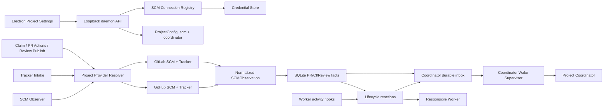

# GitLab Provider 与 Coordinator 自唤醒开发设计

> 本文是实现设计，不表示这些能力已经存在。需求与验收标准见
> [GitLab Provider 与 Coordinator 自唤醒需求](../gitlab-provider-and-coordinator-wakeup-requirements.md)。

日期：2026-07-15  
目标分支：从 `main` 创建独立 feature branch  
实现原则：先抽 provider-neutral 边界，再接 GitLab；不得在 GitLab adapter 外泄漏 GitLab DTO。

## 1. 当前实现差距

当前代码已经有 provider-neutral `ports.SCMObservation` 和 observer contract，但 production wiring 仍是单一 GitHub provider：

- `daemon/scm_wiring.go` 构造一个 GitHub Provider，并交给全局 SCM observer。
- Session claim service 仍有 `requireSameGitHubRepo`、`parseGitHubPRURL` 等 GitHub 专用逻辑。
- `TrackerProvider` enum 和 intake resolver 只接受 GitHub。
- Reviewer prompt 直接要求 Agent 执行 `gh api`，无法发布 GitLab Review。
- PR Action Service 尚未连接 daemon，Merge/Resolve 仍是 stub。
- `SessionPRSummary.provider` OpenAPI enum 只包含 `github`。
- Project Settings 中的 intake repo preview 固定调用 `deriveGitHubRepo`。
- 没有 SCM connection/credential 资源，也没有按项目解析 Provider 的 resolver。
- 没有 Coordinator durable inbox 或 wake supervisor。

实现不能只新增 `adapters/scm/gitlab`；必须先消除上述生产链路中的 GitHub 假设。

## 2. 目标架构



核心边界：

1. Project 选择 connection，connection 决定 Provider、host、API base 和 credential ref。
2. Observer/Tracker/Claim/Action 都通过同一个 project provider resolver。
3. Adapter 只产出/消费 normalized ports DTO。
4. Coordinator wake 使用独立 durable inbox；`change_log` 仍只由 SQLite trigger 生成。

## 3. 数据模型

### 3.1 ProjectConfig

新增：

```go
type SCMProvider string

const (
    SCMProviderGitHub SCMProvider = "github"
    SCMProviderGitLab SCMProvider = "gitlab"
)

type SCMProjectConfig struct {
    Provider     SCMProvider `json:"provider,omitempty"`
    ConnectionID string      `json:"connectionId,omitempty"`
    Repo         string      `json:"repo,omitempty"`
}

type CoordinatorConfig struct {
    AutoWake bool `json:"autoWake,omitempty"`
}

type ProjectConfig struct {
    // existing fields...
    SCM         SCMProjectConfig `json:"scm,omitempty"`
    Coordinator CoordinatorConfig `json:"coordinator,omitempty"`
}
```

Validation：

- Provider 必须已知。
- `ConnectionID` 必须是安全 ID component。
- `Repo` 去除 `.git` 后必须是 provider 可解析的仓库路径。
- intake enabled 时，`trackerIntake.provider` 为空则继承 SCM Provider；非空必须相等。
- 旧配置为空时默认 `{provider:"github", connectionId:"github-default"}`，只在 read/resolve 时补默认，不强制改写 JSON。

### 3.2 SCM connections

新增 migration，不修改既有 migration：

```sql
CREATE TABLE scm_connections (
    id TEXT PRIMARY KEY,
    provider TEXT NOT NULL CHECK (provider IN ('github', 'gitlab')),
    display_name TEXT NOT NULL,
    web_base_url TEXT NOT NULL,
    api_base_url TEXT NOT NULL,
    credential_ref TEXT NOT NULL,
    created_at DATETIME NOT NULL,
    updated_at DATETIME NOT NULL
);
```

Token 不进入该表。`credential_ref` 只保存 secret store key。

需要 DB trigger：

- `scm_connection_created`
- `scm_connection_updated`
- `scm_connection_deleted`

这些 trigger 只用于 CDC/UI refresh，不承载 Token。

### 3.3 CredentialStore

新增 port：

```go
type CredentialStore interface {
    Put(ctx context.Context, ref string, secret []byte) error
    Get(ctx context.Context, ref string) ([]byte, bool, error)
    Delete(ctx context.Context, ref string) error
}
```

解析顺序：

1. 项目/connection 对应环境变量 override。
2. CredentialStore 中的 write-only secret。
3. GitHub default connection 可继续 fallback 到 `gh auth token`。
4. GitLab 开发环境可 fallback 到 `AO_GITLAB_TOKEN`，不得从 `glab` 配置文件静默导入，除非后续明确增加。

桌面持久密钥必须使用操作系统 credential vault，SQLite 只保存 reference。实现前增加 ADR，明确 credential vault 是 `~/.ao` 文件状态规则的安全凭据例外；不得以同目录 master key 加密同目录 Token 的方式制造伪加密。Headless 环境使用 env source，不要求 UI secret store。

### 3.4 Coordinator inbox

新增：

```sql
CREATE TABLE coordinator_events (
    id INTEGER PRIMARY KEY AUTOINCREMENT,
    project_id TEXT NOT NULL,
    session_id TEXT,
    event_type TEXT NOT NULL,
    resource_ref TEXT NOT NULL DEFAULT '',
    dedup_key TEXT NOT NULL,
    summary_json TEXT NOT NULL DEFAULT '{}',
    state TEXT NOT NULL CHECK (state IN ('pending','leased','acknowledged','dead_letter')),
    attempt_count INTEGER NOT NULL DEFAULT 0,
    lease_owner TEXT NOT NULL DEFAULT '',
    lease_expires_at DATETIME,
    created_at DATETIME NOT NULL,
    updated_at DATETIME NOT NULL,
    acknowledged_at DATETIME,
    UNIQUE(project_id, dedup_key)
);

CREATE INDEX idx_coordinator_events_pending
ON coordinator_events(project_id, state, created_at);
```

`summary_json` 只允许 normalized values，例如 status、PR URL、Issue canonical ID；禁止 Review body、Issue body、Job log。

## 4. Provider resolver

新增 `internal/scmregistry` 或沿用 adapters registry pattern：

```go
type ProviderBundle struct {
    SCM     observe.Provider
    Tracker ports.Tracker
    Writer  ports.SCMWriter
}

type ProjectProviderResolver interface {
    Resolve(ctx context.Context, project domain.ProjectRecord) (ProviderBundle, error)
}
```

Resolver 流程：

1. 读取 `project.Config.SCM.WithDefaults()`。
2. 读取 connection metadata。
3. 从 CredentialStore/env 构造 lazy TokenSource。
4. 以 `(connectionID, updatedAt)` 缓存 Provider bundle。
5. Connection 更新事件使旧 client/token/revision cache 失效。

不能为每个 30 秒 poll 重建 HTTP client。不同 connection 必须有独立 rate-limit/backoff 状态。

SCM observer 当前持有单 Provider，应调整为“发现 subject 时按 project resolve Provider”，并按 connection/repo 分组。Provider batch 不能跨 connection。

## 5. GitLab client

目录：

```text
backend/internal/adapters/scm/gitlab/
    auth.go
    client.go
    provider.go
    observer_provider.go
    normalize.go
    provider_test.go

backend/internal/adapters/tracker/gitlab/
    tracker.go
    tracker_test.go
```

### 5.1 HTTP 规则

- Base URL：connection 的 `apiBaseUrl`，例如 `https://gitlab.dazhongresearch.com/api/v4`。
- Auth：`PRIVATE-TOKEN: <token>`。
- Project 参数优先使用 URL-encoded full path，如 `group%2Fsubgroup%2Fproject`。
- 默认 timeout 30 秒。
- User-Agent 使用 `ao-agent-orchestrator/scm-gitlab`。
- JSON response 设置严格 size limit；Job trace/raw diff 使用独立较大但有上限的 reader。
- 401 -> `ErrAuthFailed` 并 invalidate Token cache。
- 403 -> `ErrForbidden`；不能与 rate limit 混为一谈。
- 404 -> provider-neutral `ErrSCMNotFound`。
- 409/422 -> action precondition error。
- 429 -> structured `RateLimitError{RetryAfter}`。
- 分页优先跟随 RFC Link header；兼容 `X-Next-Page`，不能依赖 `X-Total`。
- 所有错误必须 scrub header、URL query 和响应中的敏感字段。

### 5.2 GitHub/GitLab API 映射

| 能力                   | GitHub 当前/目标调用                         | GitLab v4 调用                                                                                             | Adapter 输出                   |
| ---------------------- | -------------------------------------------- | ---------------------------------------------------------------------------------------------------------- | ------------------------------ |
| Preflight              | `GET /user`                                  | `GET /user`                                                                                                | credential identity/capability |
| Open changes           | `GET /repos/{owner}/{repo}/pulls?state=open` | `GET /projects/:id/merge_requests?state=opened&order_by=updated_at&sort=desc`                              | `[]SCMPRObservation`           |
| Single change          | REST pull + GraphQL pullRequest              | `GET /projects/:id/merge_requests/:iid?include_diverged_commits_count=true&with_merge_status_recheck=true` | PR metadata/mergeability       |
| Diff stats             | GitHub GraphQL stats                         | `GET /projects/:id/merge_requests/:iid/raw_diffs`，解析 unified diff                                       | additions/deletions/files      |
| MR pipeline            | statusCheckRollup                            | `GET /projects/:id/merge_requests/:iid/pipelines`                                                          | latest head-SHA pipeline       |
| Pipeline jobs          | CheckRun/StatusContext                       | `GET /projects/:id/pipelines/:pipeline_id/jobs?include_retried=false`                                      | checks                         |
| Failed log             | `GET /repos/.../actions/jobs/:job_id/logs`   | `GET /projects/:id/jobs/:job_id/trace`                                                                     | last 20 lines                  |
| Approval               | GraphQL reviewDecision/reviews               | `GET /projects/:id/merge_requests/:iid/approvals`，可选 `/approval_state`                                  | ReviewDecision/reviews         |
| Review threads         | GraphQL reviewThreads                        | `GET /projects/:id/merge_requests/:iid/discussions`                                                        | review threads/comments        |
| Resolve thread         | GraphQL resolveReviewThread                  | `PUT /projects/:id/merge_requests/:iid/discussions/:discussion_id` with `resolved=true`                    | resolve result                 |
| Reply thread           | GitHub review comment/reply                  | `POST /projects/:id/merge_requests/:iid/discussions/:discussion_id/notes`                                  | comment URL/ID                 |
| Publish summary        | `POST /repos/.../pulls/:number/reviews`      | `POST /projects/:id/merge_requests/:iid/notes`                                                             | provider review reference      |
| Publish inline finding | GitHub review comments                       | `POST /projects/:id/merge_requests/:iid/discussions` with diff position                                    | thread ID/link                 |
| Merge                  | `PUT /repos/.../pulls/:number/merge`         | `PUT /projects/:id/merge_requests/:iid/merge`                                                              | merge result                   |
| Issue get              | `GET /repos/.../issues/:number`              | `GET /projects/:id/issues/:issue_iid`                                                                      | domain.Issue                   |
| Issue list             | `GET /repos/.../issues`                      | `GET /projects/:id/issues?state=opened&assignee_username=...&labels=...`                                   | []domain.Issue                 |

GitLab API 参考：

- https://docs.gitlab.com/api/merge_requests/
- https://docs.gitlab.com/api/merge_request_approvals/
- https://docs.gitlab.com/api/discussions/
- https://docs.gitlab.com/api/pipelines/
- https://docs.gitlab.com/api/jobs/
- https://docs.gitlab.com/api/issues/

### 5.3 Remote 与 MR ref 解析

支持：

```text
https://gitlab.example.com/group/subgroup/project.git
ssh://git@gitlab.example.com/group/subgroup/project.git
git@gitlab.example.com:group/subgroup/project.git
group/subgroup/project
https://gitlab.example.com/group/subgroup/project/-/merge_requests/42
group/subgroup/project!42
!42 或 42（项目上下文已知时）
```

解析结果：

```go
ports.SCMRepo{
    Provider: "gitlab",
    Host: "gitlab.example.com",
    Owner: "group/subgroup",
    Name: "project",
    Repo: "group/subgroup/project",
}
```

Fork MR 必须使用 `source_project_id`/source project path 填充 `HeadRepo`。自动归属只能接受 source project 与 Worker push origin 相同的 MR，防止同名 fork branch 误归属。

## 6. GitLab observer 实现

### 6.1 Contract 方法

`gitlab.Provider` 实现现有 observer contract：

```go
ParseRepository(remote string) (SCMRepo, bool)
RepoPRListGuard(ctx, repo, revision string) (SCMGuardResult, error)
ListOpenPRsByRepo(ctx, repo) ([]SCMPRObservation, error)
CommitChecksGuard(ctx, repo, sha, revision string) (SCMGuardResult, error)
FetchPullRequests(ctx, refs) ([]SCMObservation, error)
FetchFailedCheckLogTail(ctx, repo, check) (string, error)
FetchReviewThreads(ctx, ref) (SCMReviewObservation, error)
```

GitLab REST 没有 GitHub GraphQL 的 25-MR batch。`FetchPullRequests` 保留 batch signature，但内部使用每 connection 最大 4 并发的 bounded errgroup；返回顺序与输入 ref 对应，单个 404 不应抹掉其他 MR。

### 6.2 Guard/revision 策略

不能假定自托管 GitLab 所有 list endpoint 都返回可靠 ETag：

- 如果 response 提供 ETag，则使用 `If-None-Match`。
- 没有 ETag 时，`RepoPRListGuard` 返回 `NotModified=false`，保证 correctness。
- `CommitChecksGuard` 可用最新 pipeline 的 `(id,status,updated_at,sha)` 计算 synthetic revision，但必须至少获取最新 pipeline。
- Provider semantic hash 继续作为业务去重；revision 只用于减少调用，不能决定事实正确性。
- 每 10 分钟强制 full reconciliation，避免 provider cache/closure 边界长期漂移。

### 6.3 MR normalized mapping

MR detail -> `SCMPRObservation`：

- `iid` -> Number。
- `web_url` -> URL/HTMLURL。
- `state=opened|merged|closed` + `draft` -> AO state。
- `source_branch`/`target_branch` -> branches。
- `sha`/`diff_refs.head_sha` -> HeadSHA。
- `diff_refs.base_sha` -> BaseSHA。
- `merge_commit_sha` or `squash_commit_sha` -> MergeCommitSHA。
- `author.username` -> Author。
- `detailed_merge_status` -> ProviderMergeStateStatus。
- `has_conflicts` -> ProviderMergeable/conflict。
- `diverged_commits_count>0` -> BehindBase。

Raw diff 统计：

- 只统计 patch 内容行，忽略 `+++`/`---` header。
- binary diff 不增加 line counts，但增加 ChangedFiles。
- 响应截断、超限或解析失败时不得返回伪造的精确值。第一阶段应给 normalized DTO 增加 `DiffStatsComplete bool`；UI 不完整时显示 `--`，而不是 `0`。

### 6.4 CI mapping

选择 pipeline：

1. 从 MR pipelines 中选择 `sha == MR HeadSHA` 的最新 pipeline。
2. 没有 MR pipeline 时，可查询 `pipelines?sha=<HeadSHA>` 作为 branch pipeline fallback。
3. 不得使用旧 SHA 的成功 pipeline 将新 commit 标记 passing。

Job mapping：

| GitLab status                                                    | AO check status    | Aggregate                                   |
| ---------------------------------------------------------------- | ------------------ | ------------------------------------------- |
| success                                                          | passed             | passing candidate                           |
| failed                                                           | failed             | failing                                     |
| canceled                                                         | cancelled          | failing                                     |
| created/waiting_for_resource/preparing/pending/running/scheduled | queued/in_progress | pending                                     |
| skipped/manual                                                   | neutral/unknown    | unknown unless provider proves non-blocking |

`ProviderID` 保存 Job ID，`URL` 保存 Job web URL。只对当前 failure fingerprint 新出现的 failed/canceled Job 获取 trace，最多 20 行、每个 Job 有字节上限。

### 6.5 Review mapping

- `approvals.approved=true` 且 required rules 满足 -> approved。
- `approvals_left>0` 或 `detailed_merge_status=not_approved` -> review_required。
- `detailed_merge_status=requested_changes` -> changes_requested。
- Discussion 中 system note 不计为 human review comment。
- `notes[].resolvable && !notes[].resolved` 构成 unresolved thread。
- Bot 判断优先使用 GitLab user type/bot 标志；不得只按 username 包含 `bot` 判断。
- Discussion 全量分页；第一版允许与 GitHub 一样只保留 bounded recent window，但必须设置 `Partial=true` 并 merge persistence。

## 7. GitLab Tracker

`Tracker.Get`：

```text
GET /projects/:encodedProject/issues/:iid
```

`Tracker.List`：

```text
GET /projects/:encodedProject/issues
  ?state=opened|closed
  &assignee_username[]=alice
  &labels=bug,ready
  &per_page=100
```

实现要求：

- 支持 subgroup path URL encode。
- `scope=all`，避免 GitLab 默认 scope 造成漏单。
- 映射 open/closed；更细的 in-progress/review/done 状态继续由 label policy 决定。
- canonical TrackerID 包含 provider、host、project 和 IID。
- confidential Issue 的 403/404 不区分返回给 UI，防止 existence leak。
- `Preflight` 使用 `/user`，repo capability 在 connection test 中独立验证。

## 8. Claim、Review publish 与 PR Actions

### 8.1 Claim

重构 `claim_pr.go`：

- 删除 `requireSameGitHubRepo` 和 GitHub URL fallback。
- 先 resolve project Provider，再调用 provider-neutral `ParseChangeRef`。
- same-repo 校验比较 normalized host + repo。
- GitHub `#number` 与 GitLab `!iid` 均支持。
- 持久化 `Provider` 后，后续 action 永远按 row Provider 路由。

### 8.2 SCM writer port

新增：

```go
type SCMWriter interface {
    Merge(ctx context.Context, ref SCMPRRef, opts MergeOptions) (MergeResult, error)
    PublishReview(ctx context.Context, ref SCMPRRef, review ReviewPublication) (ReviewPublicationResult, error)
    ReplyReviewThread(ctx context.Context, ref SCMPRRef, threadID, body string) error
    ResolveReviewThread(ctx context.Context, ref SCMPRRef, threadID string) error
}
```

GitHub 和 GitLab 都实现该 port。完成后：

- `service/pr.ActionService` 注入 store + ProjectProviderResolver，不再是 stub。
- daemon `APIDeps.PRs` 必须实际 wiring。
- Merge 使用持久化 HeadSHA 乐观锁；GitLab 传 `sha`，GitHub 传 `sha`。
- 默认 squash，只有 CI passing、无 unresolved human thread、审批满足、mergeability=mergeable 才调用 Provider。
- Resolve thread 只接受属于目标 PR/MR 的 thread ID。

### 8.3 Reviewer 去 `gh` 化

Reviewer prompt 不应直接执行 `gh api`。改为：

```text
ao review publish --session <worker> --reviews -
```

Review service 根据 Session PR 的 Provider 发布 GitHub review 或 GitLab note/discussion，并在同一业务流程中记录 AO review run。这样 Reviewer adapter 不需要 GitHub/GitLab CLI，也避免 Token 进入 Agent shell 命令。

## 9. Daemon connection API

DTO：

```go
type SCMConnectionRequest struct {
    ID          string      `json:"id"`
    Provider    SCMProvider `json:"provider"`
    DisplayName string      `json:"displayName"`
    WebBaseURL  string      `json:"webBaseUrl"`
    APIBaseURL  string      `json:"apiBaseUrl"`
    Token       string      `json:"token,omitempty"` // write-only
}

type SCMConnectionResponse struct {
    ID                   string      `json:"id"`
    Provider             SCMProvider `json:"provider"`
    DisplayName          string      `json:"displayName"`
    WebBaseURL           string      `json:"webBaseUrl"`
    APIBaseURL           string      `json:"apiBaseUrl"`
    CredentialConfigured bool        `json:"credentialConfigured"`
    Status               string      `json:"status"`
    Username             string      `json:"username,omitempty"`
}
```

Routes：

| Method | Route                               | 行为                                       |
| ------ | ----------------------------------- | ------------------------------------------ |
| GET    | `/api/v1/scm/connections`           | 返回 metadata，不返回 Token                |
| POST   | `/api/v1/scm/connections`           | 创建 metadata，write-only 保存 Token       |
| GET    | `/api/v1/scm/connections/{id}`      | 返回 metadata/status                       |
| PUT    | `/api/v1/scm/connections/{id}`      | 整体更新；Token 省略表示保留               |
| DELETE | `/api/v1/scm/connections/{id}`      | 被项目引用时 409；确认后删除 secret        |
| POST   | `/api/v1/scm/connections/{id}/test` | `/user` + repo read/write capability probe |

API error code：

- `SCM_CONNECTION_NOT_FOUND`
- `SCM_CREDENTIAL_MISSING`
- `SCM_AUTH_FAILED`
- `SCM_FORBIDDEN`
- `SCM_INSTANCE_UNREACHABLE`
- `SCM_TLS_FAILED`
- `SCM_RATE_LIMITED`
- `SCM_REPO_NOT_FOUND`
- `SCM_WRITE_SCOPE_MISSING`

不得把 provider 原始响应 body 原样回给 UI。

## 10. Desktop UI

修改 `ProjectSettingsForm.tsx`，新增 unframed `Source control` section/card，沿用现有紧凑表单风格。

新增组件：

```text
frontend/src/renderer/components/SCMConnectionFields.tsx
frontend/src/renderer/hooks/useSCMConnections.ts
frontend/src/renderer/lib/scm-repo.ts
```

状态：

- provider select：GitHub/GitLab。
- connection select + Create connection dialog。
- GitLab instance URL。
- advanced API URL。
- Token password input，保存后清空 value，仅显示 configured indicator。
- Test connection button 和结构化结果。
- repo preview/override。

创建项目流程也要支持 provider/connection，不能只在创建后 Settings 修改。

测试：

- GitHub 默认迁移不改变现有表单提交。
- GitLab 地址自动派生 `/api/v4`。
- Token 不出现在 mock response、query cache、telemetry mock。
- Provider 切换后 repo parser 和 tracker intake preview 更新。
- Unauthorized/Forbidden/Unreachable 分别显示。
- 长 subgroup/repo 文本不溢出表单。

## 11. Coordinator 自唤醒实现

### 11.1 事件生产

在 lifecycle 写 Session/SCM facts 的同一事务边界之后 enqueue coordinator event：

| 来源                | 条件                    | dedup key                                    |
| ------------------- | ----------------------- | -------------------------------------------- |
| Activity signal     | Worker `active -> idle` | `worker-idle:<session>:<activity-at>`        |
| Activity signal     | Worker进入 needs-input  | `worker-needs-input:<session>:<activity-at>` |
| Runtime observation | Worker变 terminated     | `worker-exited:<session>:<updated-at>`       |
| SCM observation     | PR ready                | `change-ready:<pr-url>:<head-sha>`           |
| SCM observation     | merged                  | `change-merged:<pr-url>:<merge-sha>`         |
| SCM observation     | closed                  | `change-closed:<pr-url>:<updated-at>`        |
| Tracker intake      | Worker spawn 成功       | `intake-spawned:<issue-id>`                  |

只为 `KindWorker` 生产，避免 Coordinator 自己 idle 形成自激循环。

写入方式：

- 在 service/lifecycle 中调用 `CoordinatorEventStore.Enqueue`。
- `UNIQUE(project_id,dedup_key)` 保证幂等。
- 这不是 CDC emission；不要手写 `change_log`。

### 11.2 Supervisor

新增：

```text
backend/internal/observe/coordinator/supervisor.go
backend/internal/service/coordinator/service.go
```

循环：

1. daemon 启动立即 reconcile，之后每 30 秒 reconcile。
2. live enqueue 使用内存 signal channel 提前唤醒循环，channel 满时丢 signal 不丢 DB event。
3. 每个 project 选择最老 pending events，5 秒 debounce，组成 batch。
4. 原子 lease batch，lease 60 秒。
5. `EnsureOrchestrator(project)`：复用 active；dead 时 restore；没有时 spawn。
6. 通过专用 guard 发送固定 control message。
7. delivery 成功后保持 leased，等待 Coordinator ACK。
8. lease 超时 attempt+1 并回 pending；3 次后 dead-letter + desktop notification。

每项目同一时间最多一个 leased batch。全 daemon 可并行处理不同项目，但 Coordinator spawn/restore 受现有 Session Manager 锁约束。

### 11.3 Guard policy

新增：

```go
func (g *Guard) CoordinatorWake(ctx context.Context, id SessionID, msg string) (Outcome, error)
```

规则：

- allow：`active`、`idle`、`waiting_input`。
- refuse：`blocked`、`exited`、terminated、unknown store state。
- `blocked` 时不增加 delivery attempt，只延迟。
- message 由 AO 模板构造，不能接收外部自由文本。

固定消息示例：

```text
[AO coordinator wake]
Project state changed. Batch: cw-1042. Events: 7.
Run `ao coordinator inbox --batch cw-1042`, continue coordination, then acknowledge the batch.
```

### 11.4 Coordinator CLI/API

CLI：

```bash
ao coordinator inbox --batch <id> --json
ao coordinator ack --batch <id>
ao coordinator wake --project <id>
```

HTTP：

```text
GET  /api/v1/projects/{id}/coordinator/inbox?batch=<id>
POST /api/v1/projects/{id}/coordinator/inbox/{batchId}/ack
POST /api/v1/projects/{id}/coordinator/wake
```

授权关系：

- CLI 从 `AO_SESSION_ID` 标识 caller，但 daemon 必须读取 Session row 验证 caller 是同项目 active Orchestrator。
- 桌面用户调用手工 wake 不需要 caller Session，但走 loopback control route。
- Worker 不能 ACK Coordinator batch。

### 11.5 Orchestrator prompt

追加规则：

1. 被 wake 后先读指定 batch，不做全库无界扫描。
2. 检查 Worker、PR/MR、CI、Review 和未分配 Issue。
3. 只在需要时 spawn/redirect Worker。
4. 完成协调动作后 ACK。
5. 无法完成时不 ACK，给用户报告 blocker。

## 12. 实施顺序

每个阶段独立 PR，避免 GitLab adapter、凭据 UI 和调度器形成不可审查的大提交。

### 阶段 1：Provider/connection foundation

- Domain enum、ProjectConfig、migration、connection service/API。
- CredentialStore port 与 env source。
- ProjectProviderResolver。
- OpenAPI/frontend types regeneration。
- 保持 GitHub 行为通过 resolver 工作。

验证：

```bash
cd backend && go test ./internal/domain ./internal/service/project ./internal/httpd/...
npm run api
npm run frontend:typecheck
```

### 阶段 2：GitLab Tracker 与 intake

- GitLab client/auth/error/pagination。
- Tracker Get/List/Preflight。
- intake 按项目 Provider resolve。
- canonical GitLab Issue ID。

验证：

```bash
cd backend && go test ./internal/adapters/tracker/gitlab ./internal/observe/trackerintake
```

### 阶段 3：GitLab SCM read path

- Remote/MR parser。
- MR discovery/detail/diff stats。
- Pipeline/jobs/log tail。
- approvals/discussions/mergeability。
- observer 多 Provider 分组。

验证：

```bash
cd backend && go test ./internal/adapters/scm/gitlab ./internal/observe/scm ./internal/lifecycle
```

### 阶段 4：Claim、Review write、Resolve、Merge

- provider-neutral change ref parser。
- SCMWriter GitHub/GitLab implementations。
- Reviewer 去 `gh api` 化。
- PR Action Service real wiring。

验证：

```bash
cd backend && go test ./internal/service/session ./internal/service/pr ./internal/review ./internal/httpd/controllers
```

### 阶段 5：Desktop UI

- Connection CRUD/test UI。
- Project provider selection。
- Create project flow。
- Provider-neutral repo preview 和 PR/MR wording。

验证：

```bash
cd frontend && npm run typecheck && npm run build
```

必须用桌面 UI 手工验证 Token write-only、错误状态和自托管 GitLab 地址。

### 阶段 6：Coordinator durable inbox/self-wake

- migration/store/service/API/CLI。
- lifecycle/intake event producers。
- supervisor、guard policy、EnsureOrchestrator。
- prompt 与通知。

验证：

```bash
cd backend && go test -race ./internal/observe/coordinator ./internal/lifecycle ./internal/sessionguard ./internal/service/coordinator
```

### 阶段 7：Parity E2E

- GitHub/GitLab adapter contract suite。
- fake GitLab server 全流程。
- 可选内网实例 smoke test，Token 由 `AO_GITLAB_TOKEN` 注入。
- 20 Worker completion burst/self-wake test。
- full backend/frontend CI。

验证：

```bash
npm run lint
npm run frontend:typecheck
cd backend && go test -race ./...
cd frontend && npm run build
```

## 13. 测试矩阵

| 范围         | 必测场景                                                                                         |
| ------------ | ------------------------------------------------------------------------------------------------ |
| Auth         | missing、invalid、expired、read-only、write-capable、rotated Token                               |
| Instance     | GitLab.com、自托管 subgroup、TLS failure、timeout、429                                           |
| MR discovery | same repo、fork、sibling/child branch、closed/merged transition                                  |
| CI           | no pipeline、old SHA pipeline、running、failed、canceled、success、manual、child pipeline        |
| Logs         | trace success、403、404、large trace、invalid UTF-8、secret scrub                                |
| Review       | no approvals、approved、approval required、requested changes、resolved/unresolved/bot Discussion |
| Mergeability | conflict、need rebase、checking、draft、CI blocked、mergeable                                    |
| Intake       | assignee、`*`、none、labels、confidential、restart dedup、20 issues                              |
| Claim        | URL、`group/project!iid`、numeric ref、wrong host/repo、takeover                                 |
| Actions      | stale SHA、precondition failure、resolve wrong thread、squash merge                              |
| UI           | Token write-only、connection switch、provider switch、long repo path、API errors                 |
| Wake         | 20 event burst、blocked Coordinator、dead Coordinator、crash windows、ACK、dead-letter           |

## 14. 完成定义

本功能只有在以下条件全部满足时才能称为完成：

- GitHub 现有 observer/intake/claim/read tests 不回归。
- GitLab 通过相同的 provider contract/behavior suite。
- GitHub 与 GitLab 项目可在同一 daemon 中并行运行。
- 除需求文档第 5.2 节由仓库所有者明确批准的内网测试凭证外，Token 不得出现在其他 Git tracked files、API read response、日志或 telemetry。
- Project Settings 可以完整创建、测试、选择 GitLab connection。
- Worker 完成 burst 可以可靠唤醒 Coordinator，daemon crash 不丢 inbox event。
- Merge/Resolve 不再返回 501/stub，并按持久化 Provider 路由。
- OpenAPI spec 与 `frontend/src/api/schema.ts` 同步生成。
- backend race tests、frontend typecheck/build 和 UI 手工验证全部通过。

## 15. 可执行任务拆分

以下任务是前述 7 个阶段的执行粒度。每个任务都必须遵循 RED -> GREEN -> focused regression -> commit，且不得提前实现后续任务。

### Task 1: Project-level SCM and Coordinator configuration

**Files:**
- Modify: `backend/internal/domain/projectconfig.go`
- Modify: `backend/internal/domain/projectconfig_test.go`
- Modify: `backend/internal/domain/tracker.go`
- Modify: `backend/internal/domain/tracker_test.go`

**Produces:** `SCMProvider`, `SCMProjectConfig`, `CoordinatorConfig`, and project-level validation/defaulting. Provider, repository, and connection selection belong to each project; there is no daemon-global active provider.

- [ ] Write failing table tests for GitHub defaults, explicit GitLab config, safe connection IDs, subgroup repo paths, tracker inheritance, and tracker/SCM mismatch rejection.
- [ ] Run `cd backend && go test ./internal/domain` and confirm failures are caused by missing types/validation.
- [ ] Implement only the domain types, defaults, and validation required by those tests. Allow `github|gitlab`; preserve old projects as `github-default` at resolve/read time without rewriting stored JSON.
- [ ] Re-run `cd backend && go test ./internal/domain` and commit as `feat: add project-level SCM configuration`.

### Task 2: SCM connection persistence and credential boundary

**Files:**
- Create: `backend/internal/storage/sqlite/migrations/0024_scm_connections.sql`
- Create: `backend/internal/storage/sqlite/queries/scm_connections.sql`
- Create: `backend/internal/storage/sqlite/store/scm_connection_store.go`
- Create: `backend/internal/storage/sqlite/store/scm_connection_store_test.go`
- Create: `backend/internal/ports/credentials.go`
- Create: `backend/internal/adapters/credentials/keyring/store.go`
- Create: `backend/internal/adapters/credentials/keyring/store_test.go`
- Modify generated sqlc files only through `npm run sqlc`

**Produces:** metadata-only SCM connection storage and `CredentialStore.Put/Get/Delete`. SQLite stores only `credential_ref`; secrets use the OS credential vault. Headless GitLab can resolve `AO_GITLAB_TOKEN` without persisting it.

- [ ] Write failing migration/store tests for CRUD, CDC triggers, reference conflicts, and proof that token bytes never enter SQLite.
- [ ] Write failing credential adapter tests using an injected vault backend; cover put/get/delete, missing values, and redacted errors.
- [ ] Run the focused tests and confirm expected failures.
- [ ] Add migration `0024`, queries, store, credential port/adapter, run `npm run sqlc`, then re-run focused tests and commit as `feat: persist SCM connection metadata`.

### Task 3: SCM connection service and HTTP API

**Files:**
- Create: `backend/internal/service/scmconnection/service.go`
- Create: `backend/internal/service/scmconnection/service_test.go`
- Create: `backend/internal/httpd/controllers/scm_connections.go`
- Create: `backend/internal/httpd/controllers/scm_connections_test.go`
- Modify: `backend/internal/httpd/controllers/dto.go`
- Modify: `backend/internal/httpd/apispec/specgen/build.go`
- Modify: `backend/internal/httpd/server.go`
- Modify: `backend/internal/daemon/daemon.go`
- Regenerate: `backend/internal/httpd/apispec/openapi.yaml`
- Regenerate: `frontend/src/api/schema.ts`

**Produces:** connection CRUD/test routes. Read responses expose metadata, `credentialConfigured`, status, and username, never token. Token omission on PUT retains the existing secret; deletion of referenced connections returns 409.

- [ ] Write failing service/controller tests for CRUD, URL validation, write-only token, retain/replace/remove credential behavior, reference conflict, and structured error codes.
- [ ] Run focused service/controller tests and confirm expected failures.
- [ ] Implement routes and DTOs, wire dependencies, run `npm run api`, then run `cd backend && go test ./internal/service/scmconnection ./internal/httpd/...`.
- [ ] Verify generated API responses contain no token field and commit as `feat: add SCM connection API`.

### Task 4: Project provider resolver and GitHub compatibility

**Files:**
- Create: `backend/internal/scmregistry/resolver.go`
- Create: `backend/internal/scmregistry/resolver_test.go`
- Modify: `backend/internal/daemon/scm_wiring.go`
- Modify: `backend/internal/daemon/tracker_intake_wiring.go`
- Modify: `backend/internal/daemon/lifecycle_wiring.go`

**Produces:** `ProjectProviderResolver.Resolve(ctx, project)` returning connection-scoped SCM/Tracker/Writer bundles cached by connection version. GitHub default behavior continues through `github-default`.

- [ ] Write failing resolver tests for old-project GitHub fallback, explicit project-level GitHub/GitLab selection, independent connection caches, invalidation after connection update, and missing credentials.
- [ ] Run focused tests and confirm expected failures.
- [ ] Implement resolver interfaces and move GitHub construction behind the resolver without changing observer behavior yet.
- [ ] Run resolver plus daemon/GitHub regressions and commit as `refactor: resolve SCM providers per project`.

### Task 5: GitLab HTTP client and authentication

**Files:**
- Create: `backend/internal/adapters/scm/gitlab/auth.go`
- Create: `backend/internal/adapters/scm/gitlab/client.go`
- Create: `backend/internal/adapters/scm/gitlab/client_test.go`

**Produces:** bounded GitLab REST client using `PRIVATE-TOKEN`, 30-second timeout, encoded project paths, pagination, response-size limits, token invalidation, structured 401/403/404/409/422/429/network/TLS errors, and scrubbed diagnostics.

- [ ] Write failing `httptest` cases for auth header, subgroup encoding, RFC Link and `X-Next-Page`, missing/rotated token, every status mapping, rate-limit retry metadata, size limits, and secret scrubbing.
- [ ] Run `cd backend && go test ./internal/adapters/scm/gitlab` and confirm missing implementation failures.
- [ ] Implement the minimal client/auth layer and re-run the focused suite.
- [ ] Commit as `feat: add GitLab API client`.

### Task 6: GitLab issue tracker

**Files:**
- Create: `backend/internal/adapters/tracker/gitlab/tracker.go`
- Create: `backend/internal/adapters/tracker/gitlab/tracker_test.go`
- Modify: `backend/internal/domain/tracker.go`

**Produces:** `ports.Tracker` for `GET /projects/:encoded/issues/:iid`, paginated issue list with `scope=all`, opened/closed state, assignee (`username`, `*`, `none`), all-label matching, confidential 403/404 non-disclosure, and canonical host/project/IID IDs.

- [ ] Write failing tracker contract tests for get/list/preflight, subgroup paths, filters, pagination, labels, confidential issues, rate limit, and canonical ID round trips.
- [ ] Run focused tests and confirm expected failures.
- [ ] Implement `ports.Tracker`, reusing the GitLab client without leaking GitLab DTOs.
- [ ] Run tracker tests and commit as `feat: add GitLab issue tracker`.

### Task 7: Multi-provider issue intake

**Files:**
- Modify: `backend/internal/observe/trackerintake/observer.go`
- Modify: `backend/internal/observe/trackerintake/observer_test.go`
- Modify: `backend/internal/daemon/tracker_intake_wiring.go`
- Modify: `frontend/src/renderer/components/IntakeFields.tsx`
- Modify: `frontend/src/renderer/components/IntakeFields.test.tsx`

**Produces:** intake resolves the project's SCM connection/provider, derives provider-neutral repo keys, supports GitLab filters, and preserves durable IssueID dedup across restarts.

- [ ] Write failing observer/UI tests for mixed GitHub/GitLab projects, inherited provider, subgroup preview, assignee/labels, confidential issues, restart dedup, and 20-issue scans.
- [ ] Run focused Go and frontend tests and confirm expected failures.
- [ ] Implement provider routing and provider-neutral repo preview without changing direct Worker issue-context trust boundaries.
- [ ] Re-run focused tests and commit as `feat: route issue intake by project provider`.

### Task 8: GitLab MR parsing, discovery, detail, and diff stats

**Files:**
- Create: `backend/internal/adapters/scm/gitlab/provider.go`
- Create: `backend/internal/adapters/scm/gitlab/observer_provider.go`
- Create: `backend/internal/adapters/scm/gitlab/normalize.go`
- Create: `backend/internal/adapters/scm/gitlab/provider_test.go`
- Modify: `backend/internal/ports/scm.go`

**Produces:** GitLab remote/MR ref parsing, open MR discovery, fork-safe branch ownership, normalized detail and truthful diff stats with `DiffStatsComplete`.

- [ ] Write failing tests for all HTTPS/SSH/path/ref forms, nested groups, wrong host, fork MR attribution, state/SHA/branch mapping, binary diffs, truncated diffs, and incomplete-stat signaling.
- [ ] Run focused tests and confirm expected failures.
- [ ] Implement parsing/discovery/detail/raw-diff normalization with bounded four-request concurrency per connection.
- [ ] Run focused tests and commit as `feat: observe GitLab merge requests`.

### Task 9: GitLab pipelines, jobs, and failed logs

**Files:**
- Modify: `backend/internal/adapters/scm/gitlab/observer_provider.go`
- Modify: `backend/internal/adapters/scm/gitlab/normalize.go`
- Modify: `backend/internal/adapters/scm/gitlab/provider_test.go`

**Produces:** latest head-SHA pipeline selection, branch fallback, job/check normalization, aggregate CI state, synthetic revision, and bounded 20-line failed trace tail with invalid UTF-8 and secret scrubbing.

- [ ] Write failing tests for no/old/current pipeline, every documented job state, retried/manual/child jobs, aggregate priority, trace 403/404/oversize/invalid UTF-8, and log-tail scrubbing.
- [ ] Run focused tests and confirm expected failures.
- [ ] Implement only CI/job/log behavior and re-run focused tests.
- [ ] Commit as `feat: map GitLab pipelines and jobs`.

### Task 10: GitLab approvals, discussions, and mergeability

**Files:**
- Modify: `backend/internal/adapters/scm/gitlab/observer_provider.go`
- Modify: `backend/internal/adapters/scm/gitlab/normalize.go`
- Modify: `backend/internal/adapters/scm/gitlab/provider_test.go`

**Produces:** approval decisions, bounded/paginated discussions, bot/system filtering, unresolved human threads, provider blockers, behind/conflict status, and ready-to-merge only when every required condition is satisfied.

- [ ] Write failing tests for approvals-left, requested changes, unresolved/resolved/system/bot discussions, partial windows, conflict, need-rebase, checking, draft, and strict ready-to-merge gating.
- [ ] Run focused tests and confirm expected failures.
- [ ] Implement review and mergeability normalization, then re-run focused tests.
- [ ] Commit as `feat: map GitLab reviews and mergeability`.

### Task 11: Multi-provider SCM observer

**Files:**
- Modify: `backend/internal/observe/scm/observer.go`
- Modify: `backend/internal/observe/scm/observer_test.go`
- Modify: `backend/internal/daemon/scm_wiring.go`

**Produces:** subject discovery resolves provider per project, groups batches by connection/repo, maintains independent backoff/revision state, and supports GitHub and GitLab simultaneously.

- [ ] Write failing observer tests for mixed providers, no cross-connection batches, provider switch on next poll, independent 429 backoff, 20 workers without cross-attribution, and ten-minute full reconciliation.
- [ ] Run focused tests and confirm expected failures.
- [ ] Refactor observer/provider resolution without changing normalized persistence/lifecycle contracts.
- [ ] Run SCM observer, lifecycle, and both adapter suites; commit as `feat: observe SCM per project connection`.

### Task 12: Provider-neutral claim and SCM writers/actions

**Files:**
- Modify: `backend/internal/service/session/claim_pr.go`
- Modify: `backend/internal/service/session/claim_pr_test.go`
- Modify: `backend/internal/service/pr/action_service.go`
- Modify: `backend/internal/service/pr/action_service_test.go`
- Modify: `backend/internal/ports/outbound.go`
- Create: `backend/internal/adapters/scm/gitlab/writer.go`
- Create: `backend/internal/adapters/scm/gitlab/writer_test.go`
- Modify: `backend/internal/adapters/scm/github/provider.go`
- Modify: `backend/internal/daemon/lifecycle_wiring.go`

**Produces:** provider-neutral change ref parsing, persisted-provider routing, same host/repo checks, GitHub/GitLab writers, SHA-guarded squash merge, reply/resolve thread, and real PR Action Service wiring without 501 stubs.

- [ ] Write failing tests for GitHub/GitLab URL/native/numeric claims, wrong host/repo, takeover, stale SHA, merge preconditions, wrong thread, squash merge, and provider routing.
- [ ] Run focused tests and confirm expected failures.
- [ ] Implement `SCMWriter` and action wiring, preserving explicit merge authorization.
- [ ] Run session/pr/controller/GitHub/GitLab tests and commit as `feat: route PR and MR actions by provider`.

### Task 13: Provider-neutral review publication

**Files:**
- Modify: `backend/internal/review/planner.go`
- Modify: `backend/internal/review/planner_test.go`
- Modify: `backend/internal/service/review/review.go`
- Modify: `backend/internal/service/review/review_test.go`
- Modify: `backend/internal/cli/review.go`
- Modify: `backend/internal/cli/review_test.go`

**Produces:** `ao review publish --session <worker> --reviews -`; service publishes GitHub reviews or GitLab summary notes/inline resolvable discussions through the project resolver, without provider CLI commands or token exposure.

- [ ] Write failing planner/service/CLI tests for stdin payload validation, GitHub/GitLab routing, summary and inline findings, reply+resolve reuse, publication failure retention, and no `gh api`/`glab` in prompts.
- [ ] Run focused tests and confirm expected failures.
- [ ] Implement provider-neutral publication and update reviewer prompts.
- [ ] Re-run focused tests and commit as `feat: publish reviews through SCM providers`.

### Task 14: Desktop project-level SCM settings

**Files:**
- Create: `frontend/src/renderer/components/SCMConnectionFields.tsx`
- Create: `frontend/src/renderer/components/SCMConnectionFields.test.tsx`
- Create: `frontend/src/renderer/hooks/useSCMConnections.ts`
- Create: `frontend/src/renderer/lib/scm-repo.ts`
- Create: `frontend/src/renderer/lib/scm-repo.test.ts`
- Modify: `frontend/src/renderer/components/ProjectSettingsForm.tsx`
- Modify: `frontend/src/renderer/components/CreateProjectFlow.tsx`

**Produces:** per-project GitHub/GitLab selection and connection choice in create/settings flows, self-hosted URL/API derivation, write-only token input, configured/replace/remove states, structured test results, repo override/preview, and provider-aware PR/MR wording.

- [ ] Write failing component/parser tests for GitHub defaults, GitLab nested repo, connection create/select, HTTPS enforcement, API derivation, token write-only behavior, provider switching, all error statuses, and long text layout.
- [ ] Run focused Vitest tests and confirm expected failures.
- [ ] Implement the minimal UI using generated API types and existing compact form primitives; token must never enter query cache, telemetry, persistent browser storage, or read responses.
- [ ] Run focused tests, typecheck, build, and commit as `feat: configure SCM per project`.

### Task 15: Coordinator durable inbox, service, API, and CLI

**Files:**
- Create: `backend/internal/storage/sqlite/migrations/0025_coordinator_events.sql`
- Create: `backend/internal/storage/sqlite/queries/coordinator_events.sql`
- Create: `backend/internal/storage/sqlite/store/coordinator_event_store.go`
- Create: `backend/internal/storage/sqlite/store/coordinator_event_store_test.go`
- Create: `backend/internal/service/coordinator/service.go`
- Create: `backend/internal/service/coordinator/service_test.go`
- Create: `backend/internal/httpd/controllers/coordinator.go`
- Create: `backend/internal/httpd/controllers/coordinator_test.go`
- Create: `backend/internal/cli/coordinator.go`
- Create: `backend/internal/cli/coordinator_test.go`

**Produces:** deduplicated pending/leased/acknowledged/dead-letter events, atomic batches, project-scoped orchestrator authorization, inbox/ack/manual-wake HTTP routes, and `ao coordinator` commands.

- [ ] Write failing migration/store/service/API/CLI tests for dedup, lease ownership/expiry, ACK authorization, Worker refusal, dead-letter, crash windows, and safe normalized summaries.
- [ ] Run focused tests and confirm expected failures.
- [ ] Implement storage/service/routes/CLI, run `npm run sqlc` and `npm run api`, then re-run focused tests.
- [ ] Commit as `feat: add durable coordinator inbox`.

### Task 16: Coordinator event production and wake supervisor

**Files:**
- Create: `backend/internal/observe/coordinator/supervisor.go`
- Create: `backend/internal/observe/coordinator/supervisor_test.go`
- Modify: `backend/internal/lifecycle/manager.go`
- Modify: `backend/internal/lifecycle/manager_test.go`
- Modify: `backend/internal/observe/trackerintake/observer.go`
- Modify: `backend/internal/sessionguard/guard.go`
- Modify: `backend/internal/sessionguard/guard_test.go`
- Modify: `backend/internal/session_manager/prompt.go`
- Modify: `backend/internal/daemon/daemon.go`

**Produces:** durable worker/SCM/intake events, five-second batching, 30-second reconcile/cooldown, 60-second leases, three-attempt dead-letter, active/idle/waiting-input wake guard, blocked deferral, coordinator ensure/restore/spawn, fixed safe wake message, and prompt ACK instructions.

- [ ] Write failing tests for every event/dedup key, 20-event single batch, blocked Coordinator, dead restore/spawn, enqueue/paste crash windows, ACK/no-ACK retry, dead-letter notification, and no Coordinator self-loop.
- [ ] Run focused tests (including race) and confirm expected failures.
- [ ] Implement producers, supervisor, guard, daemon wiring, and prompt rules without embedding external text in wake messages.
- [ ] Run `cd backend && go test -race ./internal/observe/coordinator ./internal/lifecycle ./internal/sessionguard ./internal/session_manager` and commit as `feat: wake coordinators from durable events`.

### Task 17: Parity E2E, internal instance smoke, and status docs

**Files:**
- Create or modify focused contract tests under GitHub/GitLab adapters and `backend/internal/integration/`
- Modify: `docs/STATUS.md`
- Modify: `docs/architecture.md`
- Modify: `frontend/src/landing/content/docs/plugins/scm/gitlab.mdx`
- Modify: `frontend/src/landing/content/docs/plugins/trackers/gitlab.mdx`

**Produces:** shared adapter contract coverage, mixed-provider daemon verification, 20-worker attribution/wake burst, token-safe internal GitLab smoke evidence, final generated artifacts, and documentation that matches shipped behavior.

- [ ] Add failing integration/contract tests for the remaining completion-definition gaps and verify they fail for the expected missing behavior.
- [ ] Complete only the integration fixes needed for those tests; run `npm run api` after any DTO change.
- [ ] Inject the approved test credential only through `AO_GITLAB_TOKEN`, validate `/user` and one readable project/MR/Issue against the documented self-hosted API, and record only redacted status/capability evidence.
- [ ] Run `npm run lint`, `npm run frontend:typecheck`, `cd backend && go test -race ./...`, `cd frontend && npm test -- --run`, and `cd frontend && npm run build`; verify no tracked file except the explicitly approved requirements section contains the token.
- [ ] Visually verify Project Settings/create flow in the Electron desktop and commit as `test: verify GitLab provider parity`.
