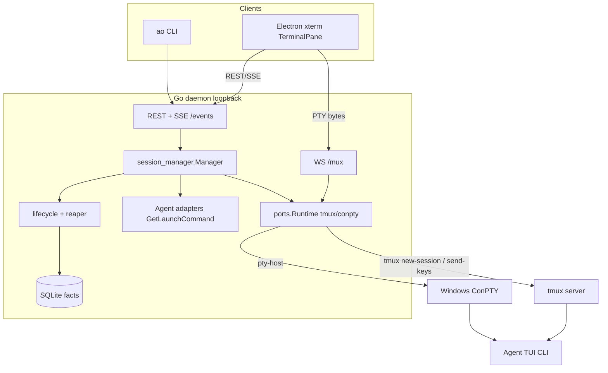
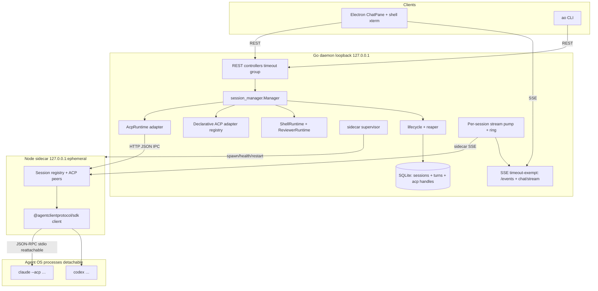
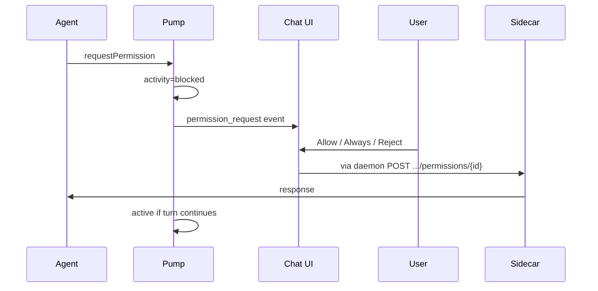
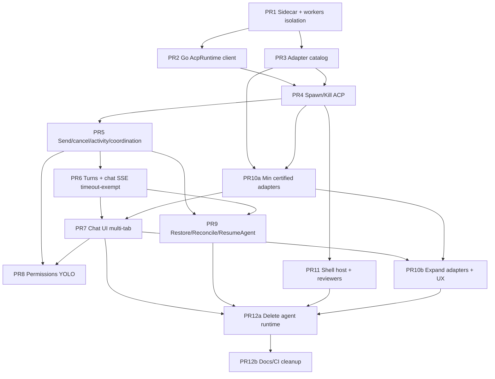

# Design: ACP Migration — Remove tmux, Node Sidecar, Chat UI

| Field | Value |
| --- | --- |
| **Title** | ACP Migration: Replace terminal-mux agent launch with Agent Client Protocol |
| **Author** | Agent Orchestrator architecture (implementation planning) |
| **Date** | 2026-07-28 |
| **Status** | Ready for implementation planning (rev 3 — design review approved) |
| **Supersedes** | Branch research `docs/research/tmux-replacement-options.md` (tmux-replacement-options branch) **for agent sessions only** — that brief recommended bundled-tmux / Unix pty-host; this plan is the human-confirmed ACP path |
| **Workspace** | `agent-orchestrator` Go rewrite + Electron/React frontend |
| **Revision** | rev 3: end_turn→idle LCM compatibility; daemon-crash worker survival; ship discipline PR4–PR7; metadata SQL migration; http↔worker IPC |

---

## Overview

Agent Orchestrator today launches coding agents inside a **terminal multiplexer** (`tmux` on Darwin/Linux, ConPTY pty-host on Windows), injects prompts via `send-keys`/keystrokes, observes activity via CLI hooks + pane capture, and surfaces a **raw xterm** over WebSocket `/mux`. That model is packaging-fragile (`RUNTIME_PREREQUISITE_MISSING`), delivery is unacknowledged (paste + Enter), and the UI is a TUI terminal rather than a first-class chat product.

This design migrates **agent sessions** to the **Agent Client Protocol (ACP)** as used by [AionUi](https://github.com/iOfficeAI/AionUi): a **Go-supervised Node sidecar** speaks ACP via `@agentclientprotocol/sdk`, while the Go daemon remains the lifecycle/control plane. The frontend replaces the agent terminal **body** with a **React chat input + streaming reply** surface (multi-session tabs preserved). **tmux is not a fallback for agents** — when ACP is the agent path, flag-off means spawn fails hard, never silent tmux.

Confirmed product decisions (not reopened):

1. Remove tmux / agent conpty — no agent dual-path fallback to tmux.
2. Align agent coverage to AionUi-style multi-agent ACP list via **declarative adapter configs**.
3. ACP client lives in a **Node sidecar** supervised by the Go daemon (not a pure-Go primary client).

**Rev-3 load-bearing decisions (reviews):**

- Agent OS processes are **not** children of the sidecar HTTP process; **session workers survive daemon crash** (tmux-class) on macOS/Linux.
- ACP sessions are **signal-capable**; stream pump stamps `FirstSignalAt` via LCM.
- ACP **end_turn / ready-for-prompt → `idle`** (preserves `worker_idle` / `safeToDeliver` / `NudgeCoordination`); not `waiting_input`.
- Chat SSE mounts **outside** `middleware.Timeout` (same group as `/events`).
- Reviewers move to the **shell-only PTY host** (not deleted with agent tmux; not blocked on ACP).
- One published **flag matrix**; production never does “flag off → tmux”.
- **No end-user desktop release** until PR7+PR10a (and preferably PR8).

---

## Background & Motivation

### Current architecture (agent path)



**Pain points**

| Area | Today | Cost |
| --- | --- | --- |
| Prerequisites | `validateRuntimePrerequisites` requires `tmux` on macOS/Linux (`manager.go`) | DMG / GUI PATH failures |
| Message delivery | `runtime.SendMessage` → `send-keys` + delayed Enter; no delivery ack | Race with permission dialogs |
| Activity | `ao hooks` + terminal detectors + reaper | Per-harness hooks; fragile |
| UI | `TerminalPane` / `XtermTerminal` / `/mux` | TUI-only |
| Persistence | tmux keeps pane across **daemon** restart | Couples agent UX to external mux |
| Agent expansion | Per-harness Go package | High cost per CLI |

Prior research (scratch `acp-research/tmux-replacement-options.md`; **not currently in-repo** under `docs/research/`) recommended bundled tmux / Unix pty-host. That path is **superseded for agent sessions** by this ACP design. PTY-host ideas remain valid for **user shells** and **reviewers**.

### Target architecture



---

## Goals & Non-Goals

### Goals (v1)

1. Spawn / send / stream / permission / kill / restore agent sessions **without tmux or agent ConPTY**.
2. Node sidecar as sole ACP protocol engine, supervised by Go; state under `~/.ao`.
3. **Agent process lifetime independent of sidecar process lifetime** (reattach after sidecar restart).
4. Declarative ACP adapter catalog aligned with AionUi coverage (stdio/http agents).
5. React chat UI replaces agent terminal **body** in `CenterPane` (tabs preserved).
6. `ao send` / `POST .../send` and **lifecycle coordination nudges** work over ACP.
7. Activity + `FirstSignalAt` derived from ACP turn lifecycle (hooks optional enrichment only).
8. High-volume stream content **not** written token-by-token into SQLite (`docs/stack.md`).
9. Reviewers have a **non-tmux** path before agent tmux deletion (shell PTY host).
10. Surgical PR series implementable without ambiguous dual-path semantics.

### Non-goals (v1)

| Non-goal | Rationale |
| --- | --- |
| Pure-Go ACP client as primary | Product decision |
| Dual-path tmux fallback for agents | Product decision |
| Full AionUi F-* parity (cron, team, undo/redo, /btw, multi-upload UX) | Core lifecycle + chat + permissions first |
| Multi-tenant / remote daemon ACP | Loopback primary listener unchanged |
| Storing full token streams in SQLite | High-volume out of SQLite |
| Replacing git worktree / project / PR / review engine domain | Unchanged |
| Mobile chat parity | Explicit degraded gap; non-goal critical path |
| Pure TUI agents without ACP | Unsupported-harness policy |
| Bundling every agent CLI | Detect/healthCheck only |
| Reviewer on ACP in v1 | Reviewers use shell PTY host; ACP reviewers later |

### Explicit recommendation: user shell terminals

**Keep a minimal PTY path for user shell tabs** (`shellterm.Service`).

| Option | Verdict |
| --- | --- |
| Remove shells entirely in v1 | Rejected |
| Reuse full agent tmux/conpty runtime forever | Rejected |
| **Minimal shell-only PTY host** (Unix creack/pty host + Windows conpty host, **not** agent launch) | **Accepted** |

**Transitional window (PR4–PR11):** agents may already be ACP while shells still use the shared `runtimeselect` tmux/conpty adapter. Doctor and packaging must say: **agents → sidecar+Node; shells → tmux (Unix) until PR11**. After PR11: shells need shell-host only, not tmux.

### Explicit recommendation: reviewers (third consumer)

Reviewers today (`review/launcher.go`) use the **same** `ports.Runtime` as workers (`Create`/`Destroy`/`Interrupt`/`IsAlive`/`SendMessage`) and frontend `TerminalTarget` kind `"reviewer"` attaches via `/mux`.

| Option | Verdict |
| --- | --- |
| (1) Reviewers → ACP in same migration | Deferred — expands catalog/UI scope |
| **(2) Reviewers → shell-only PTY host** with argv Create + byte inject; keep xterm attach | **Accepted for v1** |
| (3) Residual agent-pane runtime until later | Rejected — blocks PR12 tmux delete |

**PR12 must not merge** until reviewers run on shell PTY host (PR11 scope includes reviewer runtime wiring). Auto-review stays functional; chat UI for reviewers is out of v1.

---

## Key Decisions

| # | Decision | Rationale |
| --- | --- | --- |
| 1 | **No agent tmux fallback**; flag-off = hard error | Product; avoids dual maintenance |
| 2 | **Node sidecar + SDK pin `1.3.0`**, Go-supervised | Product; AionUi alignment; modern SDK |
| 3 | **HTTP+SSE loopback IPC** Go↔sidecar | Concurrency, debug, streaming, Windows |
| 4 | **SSE chat stream** to FE (not WS); REST for send/permission | Existing SSE client; high-volume off CDC |
| 5 | **Go owns lifecycle**; sidecar is protocol pool | architecture.md control plane |
| 6 | **Declarative ACP adapter JSON** | AionUi pattern |
| 7 | **Unsupported harnesses fail closed** | Product |
| 8 | **Durable turns in SQLite; tokens in ring/SSE only** | stack.md |
| 9 | **Minimal PTY for shells + reviewers** | Debug UX + auto-review without agent mux |
| 10 | **Activity + FirstSignalAt from ACP pump** (single writer); **end_turn → idle** | Avoids no_signal; preserves worker_idle / safeToDeliver machine |
| 11 | **Session workers survive sidecar HTTP *and* daemon crash** (double-fork / reparent); boot reattach | Preserve multi-hour unattended sessions (tmux-class) |
| 12 | **Supersede bundled-tmux research for agents** | Chat + ACP end-state |
| 13 | **Chat SSE outside request Timeout** | Same pattern as `/events` in `httpd/api.go` |
| 14 | **One in-flight turn per session** (409 if busy) | Prevents overlapping session/prompt |
| 15 | **Desktop bundles Node+sidecar; CLI needs system Node** | Closes packaging OQ |
| 16 | **Min certified adapter set before desktop default-on** | Avoid breaking default harnesses at UI flip |
| 17 | **No desktop release channel until PR7+PR10a** | Avoid agent-with-no-UI window |
| 18 | **sidecar-http reverse-proxies detached workers** (loopback HTTP + generation token) | PR1 IPC contract |

---

## Proposed Design

### 1. Component responsibilities

| Component | Owns | Does not own |
| --- | --- | --- |
| **Go daemon** | Session lifecycle, workspace, SQLite facts, CDC, reaper, sidecar supervise, HTTP API, permission policy, turn summaries, stream pump/ring, coordination delivery | ACP JSON-RPC wire details, agent TUI |
| **Node sidecar** | ACP initialize/session/prompt/cancel/permission, agent **spawn + reattach**, stream fan-in to Go | Session business rules, worktree, display status |
| **Electron renderer** | Chat UI, permission cards, stream render, multi-session tabs | Spawning agents, SQLite |
| **CLI** | Thin HTTP client | Direct sidecar access |
| **Shell PTY host** | User shells + reviewer panes | Agent sessions |

### 2. Sidecar process model + agent process isolation

#### 2.1 Layout under `~/.ao`

```
~/.ao/
  sidecar/
    listen.json          # { "port", "pid", "generation", "tokenPath" } atomic write
    token.<generation>   # 0600 bearer; per-generation
    log/sidecar.log
    adapters.d/          # optional user overlays
    agent-pids/          # optional: aoSessionId → pid map for reattach (also in SQLite)
  sessions/<id>/artifacts/
  data.db
  running.json
```

#### 2.2 Decision: agents are **not** in the sidecar process group (Option A)

**Problem:** If agent CLIs are children of the sidecar process group, any sidecar restart/crash/upgrade **kills every live agent**, regressing Unix tmux behavior where agents survive daemon death and boot `Reconcile` adopts them.

**Chosen architecture:**

| Process | Process group / supervision | Lifetime |
| --- | --- | --- |
| Sidecar Node | Child of daemon supervisor; daemon owns kill on shutdown | Restarts independently |
| Agent CLI | **Own process group** (`setsid` / Windows job object separate from sidecar); spawned by sidecar but **detached** from sidecar death | Survives sidecar restart if OS process still alive |
| Daemon | Parent of sidecar only | Crash does not require killing agents |

**Reattach protocol (sidecar restart or new generation):**

1. Durable facts: `metadata.AcpAgentPid`, `metadata.AgentSessionID`, `metadata.AcpAdapterID`, `metadata.AcpSessionID` (last known), stdio attach cookies if any (v1: pid + cwd + adapter id).
2. New sidecar generation mints **new token**; old token invalid.
3. For each non-terminated ACP session with live pid (`kill(pid,0)` / Windows equivalent):
   - If ACP transport was stdio to a dead pipe, **cannot** reattach stdio to an existing process — **important limitation**.

**Stdio ACP limitation (honest):** True ACP over **stdio** binds the agent process to the parent’s pipes. Detaching the process group without keeping the pipe endpoints alive **cannot** reattach JSON-RPC mid-flight. Therefore Option A is refined:

| Strategy | When | Behavior |
| --- | --- | --- |
| **A1 — Sidecar keeps a thin “agent supervisor” child that outlives protocol process** | Preferred long-term | A tiny native/node **agent-host** process owns the agent stdio and exposes **loopback reattach** (like Windows conpty host). Sidecar is protocol client to agent-host; agent-host survives sidecar restart. |
| **A2 — Accept death on sidecar crash for v1 stdio** | Only if A1 slips | Document as known regression; auto-resume on boot via native ACP resume / digest; elevate UX bulk-reconnect |

**v1 committed path: A1 for stdio agents + daemon-crash survival (tmux-class).**

```
Daemon (boot only starts/adopts; does NOT own worker lifetime as PG leader)
   │ supervise (restart)
   ▼
sidecar-http (restartable; reverse-proxy; holds no agent stdio)
   │ loopback HTTP to worker (same generation token)
   ▼
sidecar-worker-<session>  ◄── double-fork / setsid / detach so daemon death
   │ stdio ACP                 does NOT kill worker (macOS/Linux)
   ▼
Agent CLI (child of worker only)
```

**Committed product truth (Issue 2):** On **Darwin/Linux**, session workers **must survive daemon crash** the way tmux sessions do today. Workers are **not** mere children of the daemon process group:

1. Spawn path: daemon/sidecar starts worker with **double-fork + `setsid`** (or equivalent detach) so the worker is reparented to init/launchd and is **not** killed when the daemon PID exits.
2. Durable registry: `$AO_DATA_DIR/sidecar/workers/<aoSessionId>.json` records `{ pid, ipcPort, adapterId, acpSessionId, generation, startedAt }` (atomic write).
3. Boot: start sidecar-http → **adopt** live workers from registry (pid alive + IPC health) → Reconcile (see §4.4). No requirement to re-spawn agent if worker still holds stdio.
4. Windows: best-effort; if job-object coupling makes survival hard, document Windows as weaker (like today’s conpty coupling) but still attempt detach. Do **not** weaken Darwin/Linux to match Windows.

**PR1 acceptance (hard):** kill daemon PID → worker PID still alive → restart daemon → reattach HTTP to worker without killing agent.

**HTTP ↔ session-worker IPC contract (Issue 5 — pick committed option for PR1):**

| Item | Spec |
| --- | --- |
| Topology | **sidecar-http is reverse-proxy**; each worker owns ACP stdio + local control plane |
| Worker bind | `127.0.0.1:0` only; port written to `workers/<session>.json` |
| Worker routes | `POST /prompt`, `POST /cancel`, `POST /permission`, `GET /events` (SSE), `POST /kill`, `GET /healthz` |
| Auth | Same **generation bearer token** as sidecar-http (workers reject stale generation) |
| Routing | `POST /v1/sessions/{acpSessionId}/prompt` on HTTP process → look up worker → proxy to worker `/prompt` |
| Events | Worker `/events` SSE → HTTP process may multiplex to Go pump; Go may also dial worker directly using registry (either OK; prefer **Go pump dials worker** after Create returns ipc endpoint to avoid double-hop loss on HTTP restart) |
| Create | HTTP `POST /v1/sessions` spawns detached worker, waits for worker `/healthz`, returns acpSessionId + worker endpoint to Go |
| Not chosen | “Worker is pure stdio owner with Node cluster IPC only” — rejected for debuggability; loopback HTTP is curl-able |

**Crash matrix (no “may”)**

| Failure | Agent + worker | Durable turns | UX / recovery |
| --- | --- | --- | --- |
| Sidecar HTTP crash | Workers **keep running** | Intact | New HTTP generation; re-read `workers/*.json`; pumps reattach |
| Worker crash | Agent dead | Intact | `activity=exited`; ResumeAgent / restore |
| **Daemon crash** | Workers **keep running** (Darwin/Linux committed) | Intact | Boot: sidecar-http up → adopt workers → Reconcile live pass |
| Clean `SaveAndTeardownAll` | Destroy all workers + agents | Intact + worktree markers | RestoreAll relaunches ACP |
| User Kill | Destroy worker + agent | Per cleanup policy | Terminated |

**If implementers cannot land detach + reattach in PR1:** do **not** ship A2 silently; slip schedule. Unattended multi-hour sessions are a product goal on macOS/Linux.

#### 2.3 Sidecar lifecycle (HTTP process)

1. Daemon boot starts supervisor after SQLite open, **before** session Reconcile that needs ACP.
2. Mint `generation` UUID + token file `token.<generation>` mode 0600.
3. Spawn sidecar-http: `node <entry> serve --host 127.0.0.1 --port 0 --data-dir $AO_DATA_DIR --token-file ... --generation ...`.
4. Parse listen port from stdout JSON line **or** atomic `listen.json`.
5. Health: `/healthz`, `/readyz`.
6. Crash → restart HTTP with **new generation + new token**; re-register existing workers from `workers/*.json`.
7. Shutdown → SIGTERM workers then HTTP; wait ≤5s; SIGKILL.

#### 2.4 Distribution (closes OQ2)

| Channel | How |
| --- | --- |
| **Desktop (canonical)** | Bundle **Node runtime + sidecar JS** (esbuild single-file preferred) under Electron resources (`Resources/ao-sidecar/`). Supervisor prefers bundled Node path. |
| **CLI / daemon-only** | Requires **system Node ≥20** on PATH; sidecar assets beside `ao` binary (`<ao-dir>/sidecar/`) or `AO_SIDECAR_ENTRY`. Doctor codes: `SIDECAR_NODE_MISSING`, `SIDECAR_ENTRY_MISSING`, `SIDECAR_UNHEALTHY`. |
| **Dev** | `AO_SIDECAR_ENTRY` → `tsx`/`node dist`; optional external Node. |

FE **never** receives sidecar URL or token — only Go talks to sidecar.

#### 2.5 SDK version

| Package | Strategy |
| --- | --- |
| `@agentclientprotocol/sdk` | Pin exact **`1.3.0`** |
| Protocol | Negotiate `protocolVersion` on initialize |
| Contract tests | PR1/PR2: TypeScript compiles against SDK 1.3.0 types; no invented RPC names in tests |

### 3. IPC contract: HTTP over loopback

#### Decision: **HTTP JSON + SSE over loopback**

| Criterion | HTTP loopback | stdio JSON-lines Go↔sidecar |
| --- | --- | --- |
| Multi-session concurrency | Natural | Manual multiplex |
| Streaming | SSE | Custom frames |
| Crash recovery | TCP reset + generation token | Framing recovery |
| Debug | curl | Custom |
| Windows | First-class | OK but costlier |

**Auth:** Bearer token per generation; `Authorization: Bearer …`; `X-Request-Id`; `X-AO-Session-Id`.

**Timeouts**

| Op | Timeout | On fire |
| --- | --- | --- |
| Connect | 2s | Retry / fail spawn |
| `session/new` / initialize | 70s default; **150s** for adapters tagged `slowConnect` (codex) | Error `ACP_CONNECT_TIMEOUT`; activity unchanged until create fails |
| Prompt **stream idle** | Default **15 min** without any sessionUpdate **or** tool_call heartbeat | **Cancel in-flight turn** via ACP cancel; persist partial assistant text; set `activity_state=idle` (ready for next prompt); surface error code `ACP_TURN_IDLE_TIMEOUT` on stream + optional notification. **Does not** set `exited` or `waiting_input`. **Does not** treat as reaper death. |
| Permission wait | 30 min (AionUi) | Auto-reject permission; turn may continue or end per agent |

#### Sidecar HTTP API (v1)

Base: `http://127.0.0.1:<port>/v1`

| Method | Path | Purpose |
| --- | --- | --- |
| `GET` | `/healthz` | Liveness |
| `GET` | `/readyz` | Ready |
| `GET` | `/adapters` | Catalog + health |
| `POST` | `/sessions` | Create/resume ACP session (starts/attaches worker) |
| `POST` | `/sessions/{acpSessionId}/prompt` | Start prompt (202 + turnId) |
| `POST` | `/sessions/{acpSessionId}/cancel` | Cancel turn |
| `POST` | `/sessions/{acpSessionId}/permission` | Resolve permission |
| `DELETE` | `/sessions/{acpSessionId}` | Close + kill worker/agent |
| `GET` | `/sessions/{acpSessionId}/events` | SSE sessionUpdate / permission / lifecycle / process_exit |
| `POST` | `/sessions/{acpSessionId}/set-config` | Model/mode when supported |

**Create session body — permissionMode uses AO kebab-case on the wire from Go; sidecar maps to agent flags:**

```json
{
  "aoSessionId": "sess_…",
  "adapterId": "claude-code",
  "cwd": "/Users/…/.ao/worktrees/…",
  "env": { "AO_SESSION_ID": "…", "AO_DATA_DIR": "…" },
  "mode": "new",
  "resume": { "agentSessionId": "…", "contextDigest": "…" },
  "permissionMode": "accept-edits",
  "systemPrompt": "…",
  "prompt": "optional initial user text",
  "clientCapabilities": { "fs": { "readTextFile": true, "writeTextFile": true } }
}
```

#### PermissionMode serialization boundary

| Layer | Values |
| --- | --- |
| AO domain / REST / SQLite | kebab-case: `default`, `accept-edits`, `auto`, `bypass-permissions` (`domain/agentconfig.go`) |
| Go → sidecar JSON | **Same kebab-case** (no camelCase invent) |
| Sidecar → agent CLI | Per-adapter templates in catalog (`env`, `acpArgs`, flags) |
| UI | Display labels; store/API kebab-case |

Round-trip test required: project config permissions → create payload unchanged enum set.

### 4. Go SessionManager changes

#### 4.1 Remove tmux prerequisite & send-keys (agents)

| Concern | New behavior |
| --- | --- |
| Prerequisites | Sidecar ready + adapter healthCheck (not tmux) |
| Spawn | Workspace + optional hooks + `AcpRuntime.Create` |
| Prompt delivery | Initial prompt = first ACP `prompt` (no after-start paste) |
| Attachments | Still written to worktree; prompt gets path refs (and ACP image content parts when `promptCapabilities.image`) |
| System prompt | Passed as ACP/create field; catalog may still require file on disk for some CLIs |
| Send | `AcpMessenger` → `POST .../prompt` |
| Enter-nudge / `confirmActive` | **Deleted** for ACP |
| Concurrent send | One in-flight turn; second → **409 `TURN_IN_PROGRESS`** |
| Coordination | Lifecycle uses same Prompt path with `source=coordination` (visible user-facing text unless catalog marks silent; v1 **visible** system-tagged line in chat) |
| Restore / Resume / Reconcile | Mapped in §4.4 |
| Kill | DELETE ACP session (worker+agent) + workspace as today |
| Runtime handle | `RuntimeHandleID` stores **`acpSessionId`** (opaque); not a mux/tmux name |

#### 4.2 Port surface

```go
// ports/acp.go (new) — illustrative
type AcpRuntime interface {
    Create(ctx context.Context, cfg AcpSessionConfig) (AcpHandle, error)
    Destroy(ctx context.Context, h AcpHandle) error
    Prompt(ctx context.Context, h AcpHandle, msg AcpPrompt) (turnID string, err error)
    Cancel(ctx context.Context, h AcpHandle) error
    ResolvePermission(ctx context.Context, h AcpHandle, d AcpPermissionDecision) error
    IsAlive(ctx context.Context, h AcpHandle) (bool, error)
    // Subscribe is daemon-internal: pump owns one subscription per session.
}

type AcpPrompt struct {
    Text   string
    Source string // "user" | "cli" | "coordination" | "restore_digest"
    // Parts optional for image/embeddedContext when capabilities allow
}
```

Shell + reviewer share:

```go
type ShellRuntime interface {
    Create(ctx context.Context, cfg RuntimeConfig) (RuntimeHandle, error)
    Destroy(ctx context.Context, h RuntimeHandle) error
    IsAlive(ctx context.Context, h RuntimeHandle) (bool, error)
    Attach(ctx context.Context, h RuntimeHandle, rows, cols uint16) (Stream, error)
    // Reviewer needs:
    SendMessage(ctx context.Context, h RuntimeHandle, message string) error
    Interrupt(ctx context.Context, h RuntimeHandle) error
}
```

#### 4.3 Activity derivation, FirstSignalAt, single writer

##### Signal capability

| Session kind | `signalCapable` for `deriveStatus` |
| --- | --- |
| ACP harness (all post-cutover agents) | **true** — first ACP lifecycle event stamps `FirstSignalAt` |
| Legacy TUI harness (only during tests-only dual path if any residual) | existing hook-based predicate |
| Reviewer / shell | N/A (not session activity model) |

Without stamping `FirstSignalAt`, board shows **`no_signal`** after 90s (`service/session/status.go` `noSignalGrace`) and lifecycle `safeToDeliver` blocks orchestrator coordination on zero `FirstSignalAt`.

##### Single writer rule (ACP sessions)

| Writer | Allowed |
| --- | --- |
| **ACP stream pump → `lifecycle.ApplyActivitySignal`** | Sole writer of `activity_state` + `FirstSignalAt` for ACP sessions |
| `ao hooks` | **Metadata only** (`AgentSessionID` etc.) via `Valid=false` path; must **not** fight activity |
| Reaper | Reports runtime/worker dead → LCM may set `exited` as **backup** if pump missed `agent_process_exited` |
| Terminal activity detectors / send-keys confirm | **Removed** for ACP |

##### Full activity matrix (LCM-compatible — preferred minimal churn)

**Committed choice:** ACP **end_turn / ready-for-prompt → `idle`**, matching current harness stop/complete maps and the existing lifecycle machine. Do **not** map between-turn readiness to `waiting_input` (that would break `crossedToIdle`, `safeToDeliver`, and `NudgeCoordination` without a full LCM rewrite).

| Signal | `activity_state` | Sticky? | Notes |
| --- | --- | --- | --- |
| `session/new` or worker ready (no turn yet) | **`idle`** | no | First signal stamps `FirstSignalAt`; board may show idle (not needs_input) |
| Prompt accepted / streaming / tool in progress | `active` | no | |
| No sessionUpdate while turn open | stay `active` | — | Do not demote mid-turn by timer alone (except §3 idle-timeout cancel) |
| Turn completed (`end_turn` / prompt result) | **`idle`** | no | Enables `crossedToIdle` (worker active→idle) → `worker_idle` outbox |
| Explicit agent “needs user question” / pause-for-input ACP signal (if agent emits) | `waiting_input` | yes | Rare; board `needs_input`; **not** default between turns |
| `requestPermission` outstanding | `blocked` | yes | sessionguard refuses user send **and** NudgeCoordination |
| Permission resolved, turn continues | `active` | no | |
| Cancel completed / `ACP_TURN_IDLE_TIMEOUT` | **`idle`** | no | Partial text kept; ready for next prompt |
| `agent_process_exited` / worker dead | `exited` | — | Does **not** alone set `is_terminated` |
| Sidecar HTTP down, worker alive | keep last state | — | Stream degraded; not death |
| Time demotion of `active` → `idle` without end_turn | **Not used for ACP** | — | Turn boundaries (or idle-timeout cancel) are authoritative |

**sessionguard (unchanged semantics):**

| State | User `ao send` / chat send | `NudgeCoordination` |
| --- | --- | --- |
| `idle` | Allow | Allow (`safeToDeliver`) |
| `active` | **409 TURN_IN_PROGRESS** (v1 user); coordination may steer only if `ActiveTurnSteerer` | Only if steerable active |
| `waiting_input` | Allow instruction (user) | **Refuse** (`SuppressedAwaitingUser`) — do not treat as free |
| `blocked` | Refuse | Refuse |
| `exited` / terminated | Refuse | Refuse |

##### Lifecycle coordination compatibility (no LCM redesign)

Preserve existing functions; ACP pump only feeds correct states:

| LCM / guard function | ACP implication |
| --- | --- |
| `crossedToIdle` | Worker **active → idle** on end_turn emits `worker_idle` — requires end_turn → **idle** |
| `safeToDeliver` | Orchestrator deliverable when **idle** (or steerable active); never waiting_input/blocked |
| `orchestratorDispatchTrigger` | Fires on entering **idle** |
| `NudgeCoordination` | Refuses `NeedsInput()` — waiting_input/blocked are user pauses, not free |
| `deriveStatus` | idle → idle/SCM; waiting_input/blocked → needs_input — between-turn agents stay **idle** on board |

**Rejected alternative:** end_turn → waiting_input + rewrite LCM to treat waiting_input as free — would make every between-turn agent show **needs_input** and require changes to `crossedToIdle`, `safeToDeliver`, `orchestratorDispatchTrigger`, and guard. Not v1.

##### Exit detection (replaces agent-process supervise for ACP)

1. Sidecar/worker emits SSE `agent_process_exited` → Go pump → LCM `ApplyActivitySignal(exited)`.
2. Reaper `IsAlive` on AcpRuntime (HTTP + worker pid) is **backup only**.
3. Probe **failed** ≠ death (existing invariant).
4. `ao agent-process supervise` wrapper: **no-op / not used** for ACP adapters (`ExitDetectionMode` unused).
5. Tests: kill agent PID → `exited` without treating probe errors as death.

#### 4.4 Restore / ResumeAgent / Reconcile / handles

##### Handle identity

| Field | ACP meaning | Storage |
| --- | --- | --- |
| `metadata.RuntimeHandleID` | **`acpSessionId`** (sidecar session id). Read model **must not** expose as `terminalHandleId` for agents (null/absent). | Existing column |
| `metadata.AgentSessionID` | Native agent transcript id (resume) | Existing column |
| `metadata.RuntimeLaunchID` | Launch fence (spawn/restore); pump rejects stale signals — **not** sidecar generation | Existing column |
| `metadata.AcpAdapterID` | Catalog adapter id | **New column** (migration) |
| `metadata.AcpWorkerPID` | Detached worker OS pid for adopt | **New column** (migration) |
| `metadata.AcpWorkerPort` | Worker loopback control port (optional if only in `workers/*.json`) | Prefer file registry; column optional |
| Shell / reviewer handles | Separate namespace | Unchanged |

**SessionMetadata is a typed struct with dedicated SQLite columns** (`domain/session.go`) — not a free-form JSON bag. Remapping `RuntimeHandleID` alone is free; new fields need a **new goose migration** (never edit old migrations) + sqlc query/store updates + `domain.SessionMetadata` fields.

**PR4 migration sketch (names illustrative):**

```sql
-- new migration only
ALTER TABLE sessions ADD COLUMN acp_adapter_id TEXT NOT NULL DEFAULT '';
ALTER TABLE sessions ADD COLUMN acp_worker_pid INTEGER NOT NULL DEFAULT 0;
-- sidecar_generation is NOT stored per-session as source of truth;
-- live generation is supervisor memory + token file; workers/*.json holds ipc.
```

Store mapping: `RuntimeHandleID` continues to serialize `runtime_handle_id`; new columns map to `AcpAdapterID` / `AcpWorkerPID`. Worker ipc port remains primarily in `$AO_DATA_DIR/sidecar/workers/<id>.json` for boot adopt (avoids stale port in DB after worker restart on same session).

##### Public operations → ACP behavior

| Existing API / method | ACP behavior |
| --- | --- |
| `Spawn` | Create worktree → start worker+ACP `session/new` → optional initial prompt → MarkSpawned; store acpSessionId in `RuntimeHandleID` |
| `Kill` | Cancel turn → DELETE ACP session (kill worker+agent) → workspace teardown → MarkTerminated; clear worktree markers as today |
| `RestoreWithMode` | Workspace restore → ACP create `mode=resume` if native id + capability, else `mode=new` + digest on first prompt → maps to `RestoreModeNative` / `RestoreModeSavedPrompt` / `RestoreModeFresh` |
| `ResumeAgentWithMode` | Agent `exited` but session not terminated: **do not** preserve old terminal identity (none). Start **new** worker+ACP session in same worktree; new `acpSessionId` → update `RuntimeHandleID`. Prefer native resume command/capability when `AgentSessionID` set. Return mode like restore. **No** `RuntimeRestarter` / same-pane respawn. |
| `SaveAndTeardownAll` | For each live ACP session: destroy worker+agent (like runtime Destroy today), write `session_worktrees` markers, force-destroy worktrees as today. **Does not** leave agents running. |
| `RestoreAll` | After worktree restore, relaunch ACP (same as RestoreWithMode per row) |
| Boot `Reconcile` | Order: (0) **sidecar-http up + ready** (1) **adopt workers** from `workers/*.json` (pid alive + `/healthz`) and rebind pumps (2) live pass: if worker/agent alive → adopt session; else stash+terminate (3) reap leaked workers (4) `RestoreAll` for shutdown-saved |
| `ao session restore` / resume-agent CLI | Unchanged HTTP surface; backend behavior above |

##### RestoreMode mapping

| `RestoreMode` | When |
| --- | --- |
| `native` | ACP/session resume or load with `AgentSessionID` succeeded |
| `saved_prompt` | New ACP session; first turn uses saved task prompt (+ digest of prior turns if any) |
| `fresh` | Orchestrator / promptless relaunch with system prompt only |

##### Context digest (non-resume)

Build from last **K=20** durable turns, max **M=32 KiB** total, stored assistant text already truncated per §11. Sent as `source=restore_digest` prefix or system context per adapter capability — not full token replay.

#### 4.5 Orchestrator coordination (not deferred)

Production lifecycle delivers worker-idle nudges via `sessionguard.NudgeCoordination` into the orchestrator (`lifecycle/manager.go`). **No LCM rewrite:** rely on end_turn → **idle** so existing `crossedToIdle` / `safeToDeliver` / dispatch triggers work.

| Rule | v1 |
| --- | --- |
| Transport | Same `AcpRuntime.Prompt` with `Source=coordination` |
| Visibility | Appears in chat as a system/coordination message (not silent) |
| When orchestrator **`idle`** | Deliver immediately (`safeToDeliver` true) |
| When orchestrator `active` | Deliver only if harness is steerable (`steerActive`); else wait until idle |
| When orchestrator `waiting_input` or `blocked` | **Do not deliver** (guard `SuppressedAwaitingUser`); retry when idle |
| When `FirstSignalAt` zero | Wait (existing `safeToDeliver`) |
| Backlog drain | Unchanged: at most one nudge per entry into idle |
| Cancel | Coordination does **not** auto-cancel user turns |
| Tests | PR5: worker end_turn → idle → `worker_idle` → orchestrator delivery under fake ACP |

#### 4.6 Concurrent turn / cancel / double-send

| Situation | Behavior |
| --- | --- |
| `POST .../send` while turn streaming | **409** `TURN_IN_PROGRESS` (no auto-cancel-and-replace in v1) |
| Stop button / `POST .../cancel` | ACP cancel; partial text kept; **`idle`** |
| Empty message | Reject 400 (no Enter-nudge semantics) |
| CLI `ao send` busy | Same 409 envelope |

#### 4.7 Spawn feature parity

| Feature | ACP v1 |
| --- | --- |
| Image attachments | Write to worktree (`attachments/`); append path refs in prompt text; if `promptCapabilities.image`, also send content parts |
| System prompt | Create payload `systemPrompt`; catalog `systemPromptFile: true` keeps file write for CLIs that need it |
| Prompt delivery strategies | Collapsed to ACP prompt; `GetPromptDeliveryStrategy` ignored for ACP adapters |
| Hooks install | Optional; metadata / native id only; not required for activity |
| Binary preflight | Adapter healthCheck + resolve CLI path before Create |
| Supervise wrapper | Not used |

### 5. Sequence diagrams

#### 5.1 Spawn

```mermaid
sequenceDiagram
  participant UI as UI / CLI
  participant API as HTTP Controller
  participant SM as SessionManager
  participant WS as Workspace
  participant ACP as AcpRuntime
  participant SC as Sidecar HTTP
  participant W as Session worker
  participant Agent as ACP Agent CLI
  participant LCM as Lifecycle
  participant DB as SQLite

  UI->>API: POST /sessions
  API->>SM: Spawn(cfg)
  SM->>DB: CreateSession seed
  SM->>WS: Create worktree + provision + attachments
  SM->>ACP: Create(AcpSessionConfig)
  ACP->>SC: POST /v1/sessions
  SC->>W: start worker (detached PG)
  W->>Agent: spawn stdio ACP
  W->>Agent: initialize + session/new
  Agent-->>W: sessionId, capabilities
  SC-->>ACP: AcpHandle
  SM->>LCM: MarkSpawned
  Note over SM,LCM: Pump starts; first event stamps FirstSignalAt
  alt initial prompt
    SM->>ACP: Prompt
    ACP->>SC: POST .../prompt
  end
  SM-->>UI: 201
```

#### 5.2 Send

```mermaid
sequenceDiagram
  participant C as CLI / Chat UI
  participant SM as SessionManager
  participant G as sessionguard
  participant ACP as AcpRuntime
  participant SC as Sidecar

  C->>SM: Send
  SM->>G: refuse if blocked/terminated/exited
  alt turn in progress
    SM-->>C: 409 TURN_IN_PROGRESS
  else
    G->>ACP: Prompt(source=user|cli)
    ACP->>SC: POST prompt
    SM->>SM: persist user turn; activity→active
    SM-->>C: 200 { turnId }
  end
```

#### 5.3 Stream pump (daemon-owned)

```mermaid
sequenceDiagram
  participant W as Worker SSE
  participant Pump as Go per-session pump
  participant Ring as Ring 512 / 2MiB
  participant FE as FE subscribers
  participant LCM as Lifecycle
  participant DB as SQLite turns

  Note over Pump: Started at AcpRuntime.Create; one pump per session
  W->>Pump: sessionUpdate / permission / process_exit
  Pump->>Ring: append (drop oldest if full)
  Pump->>LCM: ApplyActivitySignal (single writer)
  Pump->>FE: fan-out to refcounted SSE clients
  Pump->>DB: on turn_complete flush assistant text (capped)
```

#### 5.4 Permission



#### 5.5 Kill / restore / resume

```mermaid
sequenceDiagram
  participant C as Client
  participant SM as SessionManager
  participant ACP as AcpRuntime
  participant W as Worker
  participant WS as Workspace

  C->>SM: Kill
  SM->>ACP: Destroy
  ACP->>W: kill worker+agent
  SM->>WS: Destroy/stash
  SM->>SM: MarkTerminated

  C->>SM: RestoreWithMode
  SM->>WS: Restore worktree
  SM->>ACP: Create resume|new
  SM->>SM: MarkSpawned + new RuntimeHandleID

  C->>SM: ResumeAgentWithMode
  Note over SM: exited only; new worker; no terminal identity
  SM->>ACP: Create resume|new in place worktree
```

### 6. Streaming path to frontend: SSE extension

#### Decision: SSE, not WebSocket

#### Router placement (critical)

In `httpd/api.go`, long-lived streams must register **outside** the `middleware.Timeout` group — same as `a.events.Register(r)` and notification streams:

```go
r.Group(func(r chi.Router) {
    r.Use(middleware.Timeout(timeout))
    // sessions REST including send, turns list, permission POST — yes
    a.sessions.Register(r)
})
// OUTSIDE timeout:
a.events.Register(r)
a.sessions.RegisterChatStream(r) // GET .../chat/stream ONLY
```

**Do not** put `chat/stream` on `SessionsController.Register` if that mounts inside the timeout group. Split register methods like notifications.

**PR6 acceptance:** integration test holds stream open **> RequestTimeout** and still receives events.

#### Pump ownership, ring, fan-out (Issue 11)

| Rule | Spec |
| --- | --- |
| When pump starts | At successful `AcpRuntime.Create` (not lazy on first FE) |
| Sidecar events sub | Pump opens `GET .../events` immediately; reconnect with backoff on HTTP death |
| FE subscribers | Reference-counted; 0 subscribers still runs pump (activity/LCM need it) |
| Ring | Last **512 events** or **2 MiB** compressed estimate, whichever first; drop oldest |
| Backpressure FE | Non-blocking send; slow client dropped (reconnect → snapshot) |
| Sidecar→Go backpressure | SSE reader must not unbounded buffer; apply max line size (e.g. 1 MiB) |
| FE reconnect snapshot | Durable turns (REST) + ring contents + open turn + pending permissions — **no** full sidecar history replay required |
| Metrics | drops, reconnects, ring size, subscriber count |

#### Chat stream events

```text
event: snapshot
event: session_update
event: permission_request
event: turn_complete
event: agent_process_exited
event: error
```

### 7. Chat UI placement

**Replace agent terminal body only** — preserve multi-session tab strip.

| Component | Change |
| --- | --- |
| `CenterPane` | **Keep** multi project-session tabs + shell tabs + add/close behavior |
| Session tab body | `ChatPane` instead of `TerminalPane` for agent sessions |
| Shell tabs | Still xterm (shell PTY) |
| Reviewer target | Still xterm attach via shell/reviewer handle (Issue 4) — not ChatPane in v1 |
| `TerminalPane` for workers | Removed from session tab path |

```
CenterPane
  tabs: [ Worker A | Worker B | Shell 1 | + ]   // multi-session preserved
  body:
    session tab → ChatPane
    shell tab → ShellXterm
    reviewer target (inspector) → ReviewerXterm if open
```

#### API: terminal handles

| Client | Agent sessions |
| --- | --- |
| `terminalHandleId` / `TerminalHandleID` | **null / omitted** for ACP sessions |
| `/mux` with session runtime handle | **Must fail cleanly** (404/410); mobile degraded |
| FE `TerminalTarget` worker kind | Map to chat route; stop mux connect for workers |

OpenAPI: `terminalHandleId` optional; document ACP sessions omit it. Regen via `dto.go` + `specgen` + `npm run api`.

### 8. Agent registry migration

#### 8.1 Declarative catalog

Ship `sidecar/adapters/default.json` + optional `~/.ao/sidecar/adapters.d/*.json`.

#### 8.2 Harness map (abbrev.)

Supported targets: claude-code, codex, opencode, qwen-code, goose, augment/auggie, kimi-cli, factory-droid, github-copilot, mistral-vibe, cursor-agent (if healthCheck), plus AionUi adds (codebuddy, openclaw, …) as certified.

**Detection for cursor/grok “if ACP available”:** catalog `healthCheck.versionCommand` + optional `acpProbe: true` (spawn `--help`/short initialize timeout). `available=false` → treat as unsupported at spawn.

Unsupported v1 unless certified: aider, amp, agy, crush, continue, devin, cline, kiro, kilocode, pi, autohand, …

#### 8.3 Unsupported policy + cutover UX

1. Catalog `supported: false` + reason + docs URL.
2. Spawn `400 HARNESS_UNSUPPORTED_ACP`.
3. **Create-task UI disables** unsupported harnesses (gray + tooltip).
4. Project defaults: on upgrade, doctor warns; optional rewrite to project’s first supported harness (not silent).
5. **Ordering:** minimum certified set (**claude-code, codex, opencode, qwen, goose, copilot, fake**, + health-detected others) lands **before** desktop default-on / PR7 user-visible flip (PR10a before or with PR7).
6. Existing unsupported sessions: read turns if any; restore/send fail with same code.

### 9. Removal plan

| Remove for agents | Replacement |
| --- | --- |
| `adapters/runtime/tmux` agent use | deleted after PR11 shells/reviewers extracted |
| Agent conpty | shells/reviewers keep Windows host |
| Agent `/mux` | chat SSE |
| Agent TerminalPane | ChatPane |
| tmux doctor for agents | sidecar doctor |
| supervise wrapper for ACP | process_exit events |

**PR12 gate:** reviewers on shell host + shells on shell host + no agent tmux imports.

### 10. API / Interface Changes

| API | Change |
| --- | --- |
| `POST /sessions` | ACP backend |
| `POST /sessions/{id}/send` | 200 + turnId; 409 TURN_IN_PROGRESS / blocked |
| `POST /sessions/{id}/cancel` | New |
| `GET /sessions/{id}/turns` | New (timeout group OK) |
| `GET /sessions/{id}/chat/stream` | New — **timeout-exempt register** |
| Permissions routes | New |
| Session DTO | `terminalHandleId` optional null for agents |
| OpenAPI | Edit `dto.go` + `apispec/specgen/build.go`; `npm run api` |

### 11. Data Model Changes

```sql
CREATE TABLE session_turns (
  id            TEXT PRIMARY KEY,
  session_id    TEXT NOT NULL REFERENCES sessions(id),
  turn_index    INTEGER NOT NULL,
  role          TEXT NOT NULL,
  content_text  TEXT NOT NULL DEFAULT '',
  content_json  TEXT,
  status        TEXT NOT NULL,
  created_at    TEXT NOT NULL,
  completed_at  TEXT
);
CREATE INDEX session_turns_session_idx ON session_turns(session_id, turn_index);
```

**Caps (v1 defaults — not open questions):**

| Cap | Value |
| --- | --- |
| Max `content_text` stored per turn | **64 KiB**; overflow → truncate + `artifacts/turn-<id>.txt` pointer in `content_json` |
| Retention | Keep last **500 turns** per session; prune on insert (oldest first) |
| CDC | Turn inserts **do** emit CDC if table has triggers; FE uses turns REST + chat stream for content — CDC only invalidates queries, must not carry full text in notification payloads. Prefer **no high-volume fields** in CDC payload (id, session_id, turn_index, status only) via trigger payload design or non-CDC store write pattern consistent with architecture (prefer trigger with slim payload). |

### 12. Feature-flag matrix + ship discipline (no dual-path, no headless desktop)

| Phase | `AO_ACP_RUNTIME` default | Flag off means | Agent tmux | Ship to end users? |
| --- | --- | --- | --- | --- |
| PR1–PR3 | n/a | n/a | still used by agents on main | Yes (no agent path change) |
| PR4–PR6 on `main` / CI | **on for ACP integration tests**; internal/dev builds may enable ACP | **Hard error** — **never tmux** | Dead for agents when ACP path compiled/enabled | **No desktop release / auto-update** |
| PR7 + PR10a | **on** | Kill-switch only | Still in tree for shells/reviewers until PR11–12 | **First allowed desktop release** (chat UI exists) |
| PR8 (preferred same train) | on | kill-switch | shells/reviewers | Permissions recommended in same train |
| PR12 | removed | — | Agent tmux **deleted** | Yes |

**Ship rule (Issue 3):** After PR4, agents have **neither TUI nor ChatPane** until PR7. Therefore:

1. **Do not** cut a GitHub Releases / auto-update desktop channel build from commits that include PR4–PR6 without PR7+PR10a.
2. Intermediate work is **CI, local dev, and optional experimental nightlies** labeled experimental — not production auto-update.
3. “Release builds use ACP” means **internal main builds after PR4**, not “publish to users.”
4. Rollback for users = previous **published** desktop binary, not flag→tmux.

**Never:** flag off → tmux agent path after PR4 lands ACP as the agent implementation.

### 13. Shell PTY transitional + PR11 concrete design

#### Today

`shellterm.Service` has a narrow interface but is wired to the **same** `runtimeselect` runtime as agents (`daemon` wiring).

#### PR4–PR10 window

| Consumer | Runtime |
| --- | --- |
| Agents | ACP |
| Shells | **Still tmux (Unix) / conpty (Windows)** via shared adapter |
| Reviewers | Still shared adapter until PR11 |

Doctor matrix this window:

- Agents: Node + sidecar + adapter health
- Shells: tmux on Unix (WARN/FAIL as today) until PR11
- Messaging: “Agent Orchestrator no longer needs tmux for **agents**; shell tabs still require tmux until … ”

#### PR11 concrete

| OS | Module | Notes |
| --- | --- | --- |
| Darwin/Linux | New `adapters/runtime/shellhost` using `creack/pty` + scrollback ring (port Windows conpty host patterns from `adapters/runtime/conpty`) | No tmux binary |
| Windows | Keep conpty host **for shells+reviewers only** | Strip agent-only APIs if any |
| Handle IDs | Prefix `shell:` / `review:` vs `acp:` already separate stores | Mux must not accept bare session RuntimeHandleID for agents |
| Route | Prefer **`/shell-mux`** cutover; or `/mux` only for shell/reviewer handle namespace with explicit reject of ACP ids |
| Reviewer launcher | `reviewerRuntime` → `ShellRuntime` (Create/SendMessage/Interrupt/IsAlive/Destroy) | PR11 acceptance: auto-review e2e without tmux on Unix |

### 14. Security & Privacy

| Threat | Mitigation |
| --- | --- |
| Local calls to sidecar | Loopback + **per-generation** bearer token; old generation fails auth |
| Token lifecycle | Supervisor mints on each HTTP start; delete old token files; workers validate generation |
| FE sees sidecar | **Never** proxy sidecar to renderer or LAN listener |
| LAN | ADR-0001 unchanged; sidecar bind 127.0.0.1 only |
| YOLO | Default off |
| Logs | No full prompt bodies at info |

### 15. Observability

Sidecar start/fail/restart, connect latency, turn idle timeouts, permission waits, ring drops, adapter health, worker reattach success/fail. UI toast on stream disconnect with auto-retry.

### 16. Risks

| Risk | Severity | Mitigation |
| --- | --- | --- |
| Stdio reattach complexity (A1 workers) | Critical | PR1 architecture; tests for HTTP restart with live worker |
| Agent death if A1 slips / workers daemon-coupled | Critical | PR1 daemon-kill test required; slip if fail |
| end_turn mis-mapped to waiting_input | Critical | Fixed rev3 → idle; LCM tests PR5 |
| Headless agent desktop mid-series | Critical | Ship rule: no release until PR7+PR10a |
| no_signal without FirstSignalAt | Critical | Pump stamps via LCM; tests PR5 |
| Chat SSE under Timeout | Critical | Register outside group; soak test |
| Reviewer broken at PR12 | Critical | PR11 reviewer on shell host; PR12 gate |
| Unsupported harness user break | High | PR10a before PR7; UI disable; doctor |
| Dual-path confusion | High | Flag matrix §12 |
| Coordination regression | High | PR5 rules + tests |
| Large turn SQLite bloat | Medium | 64KiB cap + 500 retention |
| SDK churn | Medium | Pin 1.3.0 + contract tests |

### 17. Open Questions (remaining)

1. Exact per-CLI ACP flags — catalog at implement time.
2. ~~Node bundling~~ — **decided** §2.4.
3. ~~Turn retention~~ — **decided** 500 / 64KiB.
4. Mobile chat timeline — still later.
5. ~~Coordination silent messages~~ — **decided** v1 visible coordination; deliver on **idle**.
6. ~~Agent-host / worker IPC~~ — **decided** §2.2 loopback HTTP reverse-proxy + detached workers.
7. ~~end_turn activity~~ — **decided** → **idle** (LCM compatibility).
8. ~~Daemon crash~~ — **decided** workers survive on Darwin/Linux.
9. Windows worker detach strength vs Darwin — implementer measures; Darwin/Linux bar is non-negotiable.

### 18. Alternatives Considered

(A) Bundled tmux — superseded for agents.  
(B) Pure-Go ACP — rejected primary.  
(C) Electron-main ACP — rejected primary.  
(D) stdio Go↔sidecar IPC — rejected.  
(E) Chat WebSocket — rejected v1.  
(F) Dual-path tmux fallback — rejected; kill-switch only.  
(G) Agents in sidecar process group (kill on restart) — **rejected** (Issue 1); choose A1 workers.

### 19. Divergence from prior tmux research

| Prior research | This design |
| --- | --- |
| Bundle tmux | Not for agents |
| Unix pty-host | **Shells + reviewers** |
| Hybrid TUI+JSONL UI | Chat primary via ACP |
| Keep agent Runtime/mux | Agents leave; shells/reviewers keep PTY subset |

### 20. References

- `docs/architecture.md`, `docs/STATUS.md`, `docs/stack.md`, `AGENTS.md`
- `session_manager/manager.go`, `lifecycle/manager.go`, `service/session/status.go`
- `httpd/api.go` (timeout split), `terminal_mux.go`
- `review/launcher.go`, `service/shellterm`
- `domain/activity.go`, `domain/agentconfig.go`, `domain/harness.go`
- Scratch research: `…/grok-501/acp-research/*` (not in-repo `docs/research/` unless later landed)
- ACP: agentclientprotocol.com, `@agentclientprotocol/sdk@1.3.0`

---

## PR Plan



---

### PR1 — feat: Node ACP sidecar + detachable session workers + Go supervisor

**Dependencies:** none  

**Files:** `sidecar/**` (http reverse-proxy + worker), `backend/internal/sidecar/supervisor.go`, worker registry under `~/.ao/sidecar/workers/`, `daemon.go`, `cli/doctor.go`, desktop copy Node+sidecar assets  

**Description:** HTTP serve process reverse-proxies to **detached** session workers (A1 + daemon-crash survival). Worker loopback API (`/prompt|/cancel|/events|/kill|/healthz`) with generation token. Per-generation tokens. SDK 1.3.0; **contract compile tests against SDK types**.  

**Acceptance:**
- [ ] HTTP restart does **not** kill session worker PIDs
- [ ] **Daemon PID kill** does **not** kill session worker PIDs (Darwin/Linux); restart daemon → adopt worker from `workers/*.json` + healthz
- [ ] Worker IPC: bind `127.0.0.1:0`, routes above, auth = generation token; HTTP proxies prompt
- [ ] New generation invalidates old token
- [ ] Doctor: `SIDECAR_NODE_MISSING` / `SIDECAR_UNHEALTHY`
- [ ] Desktop bundles Node+sidecar; CLI path documented
- [ ] TS builds against `@agentclientprotocol/sdk@1.3.0` types

---

### PR2 — feat: Go AcpRuntime port + HTTP client

**Dependencies:** PR1  

**Files:** `ports/acp.go`, `sidecar/client.go`, fakes, unit tests  

**Acceptance:**
- [ ] Typed errors; correlation headers
- [ ] Client unit tests; no invented RPC names without SDK fixtures

---

### PR3 — feat: Declarative ACP adapter catalog

**Dependencies:** PR1  

**Files:** `sidecar/adapters/default.json`, load + overlay, healthCheck, fake adapter  

**Acceptance:**
- [ ] Overlay from `adapters.d`
- [ ] Fake always available
- [ ] kebab-case permissionMode accepted on create API

---

### PR4 — feat: Session spawn/kill via ACP

**Dependencies:** PR2, PR3  

**Files:** `session_manager` Spawn/Kill ACP path; **new goose migration** for `acp_adapter_id` / `acp_worker_pid`; `domain.SessionMetadata` + sqlc/store; seed rollback; attachments+system prompt; flag kill-switch only  

**Acceptance:**
- [ ] Fake spawn without tmux
- [ ] Flag off → hard error, **not** tmux
- [ ] Attachments on disk + path refs
- [ ] Kill reaps worker+agent
- [ ] New metadata columns round-trip; `RuntimeHandleID` = acpSessionId
- [ ] **Not** published as desktop release without PR7 (ship rule §12)

---

### PR5 — feat: send/cancel, activity+FirstSignalAt, coordination, turn busy

**Dependencies:** PR4  

**Files:** acpMessenger; sessionguard; LCM from pump; delete Enter-nudge for ACP; lifecycle coordination Prompt; review launcher **not yet** (see PR11); cancel API  

**Acceptance:**
- [ ] First ACP event stamps `FirstSignalAt` (table test); no_signal not shown for healthy fake
- [ ] Activity matrix: **end_turn → idle**; permission → blocked; cancel → idle
- [ ] Worker active→idle emits `worker_idle` via existing `crossedToIdle` (no LCM rewrite)
- [ ] Orchestrator delivery when **idle**; refused when waiting_input/blocked
- [ ] Single writer: hooks metadata-only path tested
- [ ] 409 TURN_IN_PROGRESS on double send
- [ ] worker_idle → orchestrator coordination delivery test (fake ACP)
- [ ] `agent_process_exited` → exited; probe failure ≠ death

---

### PR6 — feat: durable turns + chat stream SSE (timeout-exempt)

**Dependencies:** PR5  

**Files:** migration; store; `GET turns`; `RegisterChatStream` **outside** Timeout in `httpd/api.go`; `dto.go` + specgen; ring/pump  

**Acceptance:**
- [ ] No per-token SQLite rows
- [ ] 64KiB cap + 500 retention
- [ ] Stream survives **> RequestTimeout**
- [ ] Snapshot on reconnect
- [ ] `npm run api` drift clean

---

### PR10a — feat: minimum certified ACP adapters before UI flip

**Dependencies:** PR3, PR4  

**Files:** catalog entries + health for claude-code, codex, opencode, qwen, goose, copilot, fake; harness aliases; spawn unsupported code  

**Acceptance:**
- [ ] Listed adapters healthCheck in CI where binaries available / fake otherwise
- [ ] Unsupported harness 400 stable code
- [ ] Blocks PR7 default-on

---

### PR7 — feat: React ChatPane (preserve multi-session tabs)

**Dependencies:** PR6, PR10a  

**Files:** `chat/*`, CenterPane body swap only, SessionView, FE types null terminalHandleId, e2e smoke-chat  

**Description:** First user-visible agent UI on ACP path. **Together with PR10a, this is the earliest desktop release-train candidate** (§12 ship rule).  

**Acceptance:**
- [ ] Multi-session tabs still work; body is ChatPane
- [ ] No mux connect for agent sessions
- [ ] typecheck + e2e fake harness stream
- [ ] Release checklist notes: no auto-update channel from PR4–PR6 alone

---

### PR8 — feat: Permission cards + YOLO

**Dependencies:** PR5, PR7  

**Files:** permission bridge, API, UI cards, bypass-permissions auto-allow, 30m timeout  

**Acceptance:**
- [ ] blocked → resolve → continue
- [ ] YOLO auto-allow
- [ ] kebab-case modes round-trip

---

### PR9 — feat: Restore / Reconcile / ResumeAgent without tmux

**Dependencies:** PR5, PR6  

**Files:** RestoreWithMode, ResumeAgentWithMode, Reconcile order (sidecar first), SaveAndTeardownAll destroys workers, RestoreMode mapping  

**Acceptance:**
- [ ] Mapping table implemented
- [ ] ResumeAgent issues new acpSessionId
- [ ] Boot: sidecar ready before reconcile
- [ ] HTTP sidecar restart reattaches pump to live worker (A1)

---

### PR10b — feat: expand adapters + upgrade UX

**Dependencies:** PR10a, PR7  

**Files:** more AionUi adapters; UI disable unsupported; doctor matrix; docs support matrix  

**Acceptance:**
- [ ] Create-task flow hides/disables unsupported
- [ ] Doctor upgrade notes

---

### PR11 — feat: Shell-only PTY host + reviewer runtime migration

**Dependencies:** PR4  

**Files:** `adapters/runtime/shellhost` (Unix); Windows conpty shells-only; shellterm wiring; `review/launcher.go` → ShellRuntime; `/shell-mux` or mux namespace; doctor  

**Acceptance:**
- [ ] Shells work **without tmux on PATH** (Unix)
- [ ] Reviewer spawn/notify/alive/cancel without tmux
- [ ] Agent code does not import tmux
- [ ] Handle namespace rejects ACP ids on shell mux

---

### PR12a — chore: delete agent tmux/conpty path and agent xterm

**Dependencies:** PR7, PR9, PR11, PR10b  

**Files:** delete agent tmux usage; strip agent conpty; remove agent TerminalPane paths; SendMessage agent paths; terminal activity detectors for agents  

**Acceptance:**
- [ ] grep gate: no agent spawn tmux
- [ ] `go test` without tmux for agent packages
- [ ] Reviewer+shell still green

---

### PR12b — docs: architecture/stack/STATUS/CI cleanup

**Dependencies:** PR12a  

**Files:** `docs/architecture.md`, `stack.md`, `STATUS.md`, CI tmux requirements, README doctor text  

**Acceptance:**
- [ ] Docs match target architecture
- [ ] CI reflects shellhost/ACP not agent tmux

---

## Appendix A — SDK contract note

Pseudo-code in design is illustrative. Implementation **must** use `@agentclientprotocol/sdk@1.3.0` exported client APIs and types; PR2 fixtures import SDK types for initialize/session/prompt/cancel/permission.

## Appendix B — PermissionMode map

| AO kebab-case | Sidecar create field | Typical agent behavior |
| --- | --- | --- |
| `default` | `permissionMode: "default"` | Forward permissions to UI |
| `accept-edits` | `accept-edits` | Auto-allow edit-kind |
| `auto` | `auto` | Adapter-defined |
| `bypass-permissions` | `bypass-permissions` | YOLO auto-allow first option |

## Appendix C — Flag & doctor cheat sheet

| Check | PR4–10 | After PR11 |
| --- | --- | --- |
| Node+sidecar | required for agents | required |
| tmux | required for shells/reviewers (Unix) | not required |
| Shell host | n/a | required |

---

*End of design document (rev 2).*
