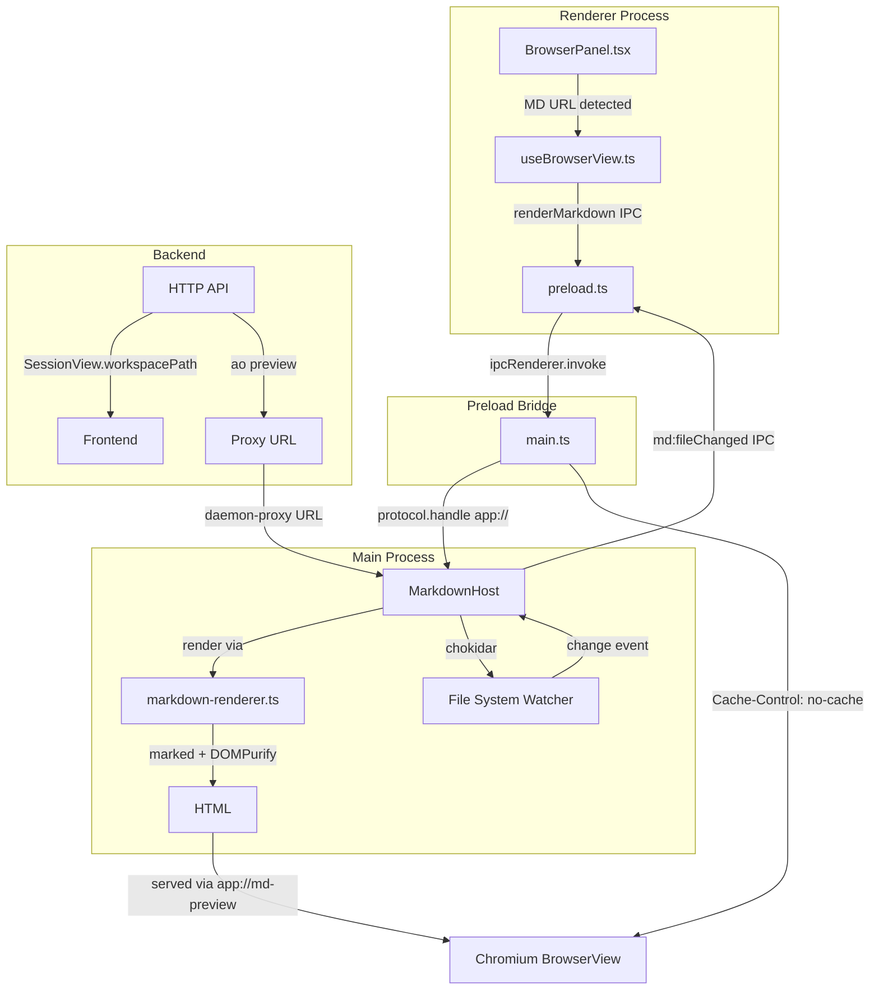
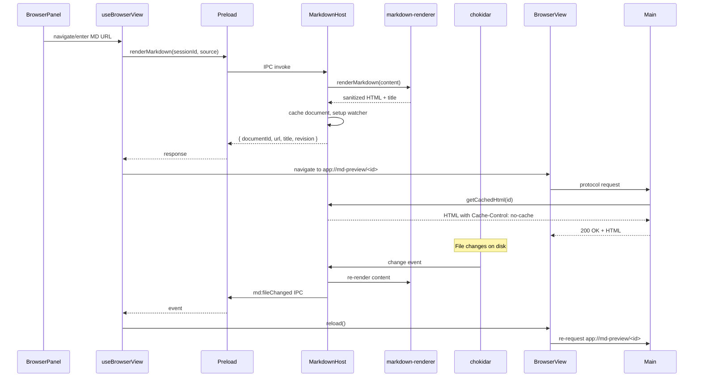

# Markdown Preview in Browser Panel — Implementation

PR [#2387](https://github.com/AgentWrapper/agent-orchestrator/pull/2387) adds the ability to render `.md` files as styled HTML inside the Electron browser panel, with file-watching for live refresh. This document explains the architecture, all changes, and known merge conflicts.

---

## Motivation

Before this PR, the browser panel could only navigate to HTTP/HTTPS/file URLs. Agents producing markdown output (reports, specs, summaries) had no way to preview it within the Electron UI. The implementation solves two problems:

1. **Chromium caching:** The `app://md-preview` custom protocol response was being cached by Chromium — after a file change, `reload()` served stale HTML instead of re-invoking the protocol handler.
2. **Daemon proxy URLs:** When markdown files were served through the daemon proxy (`http://host/api/v1/sessions/<id>/preview/files/<entry>`), the `resolveLocalPath()` function only handled `file://` URLs, so chokidar watchers were never set up.

---

## Architecture Overview



---

## Data Flow



---

## Changes by Layer

### 1. Backend Go — Surface `workspacePath` via API

| File | Change | Motivation |
|---|---|---|
| `backend/internal/httpd/controllers/dto.go` | Added `WorkspacePath string` field to `SessionView` struct | Frontend needs the session worktree path to resolve daemon-proxied file URLs to local paths |
| `backend/internal/httpd/controllers/sessions.go` | Populated `WorkspacePath` from `s.Metadata.WorkspacePath` in `sessionView()` | Extract the curated field from the hidden metadata |
| `backend/internal/httpd/controllers/sessions_test.go` | Removed negative assertion `"list leaked workspacePath"` | `workspacePath` is now a curated field (not leaked metadata), so the assertion is obsolete |
| `backend/internal/httpd/apispec/openapi.yaml` | Added `workspacePath: string` to SessionView schema | Keep API spec in sync with the DTO |

### 2. Backend Go — Multi-Skill System & Agent Prompting

| File | Change | Motivation |
|---|---|---|
| `backend/internal/skillassets/skillassets.go` | Refactored from single-embed to multi-embed; renamed `SkillName` → `UsingAoName`; added `MarkdownPreviewName`; added `DirFor()` helper | Previously only the `using-ao` skill was embedded. Now any number of skills can coexist under `skills/`. |
| `backend/internal/skillassets/skillassets_test.go` | Updated test to verify both skills are installed; clobber test uses the common parent `skills/` | |
| `backend/internal/session_manager/manager.go` | Added `aoMarkdownPreviewPointer()` appended to every agent system prompt | Agents need to know they can produce `.md` output for the browser panel |

**Embedded skill structure:**
```
<dataDir>/skills/
├── using-ao/
│   ├── SKILL.md
│   └── commands/
└── markdown-preview/
    └── SKILL.md
```

### 3. Frontend — New Shared Types

**`frontend/src/shared/markdown-types.ts`** — Type definitions consumed by both main and renderer:

| Type | Purpose |
|---|---|
| `MarkdownSourceKind` | `"file" \| "virtual" \| "url"` — discriminator for source variants |
| `MarkdownSource` | Union type: `file` (local path), `virtual` (inline content), `url` (remote/daemon-proxy URL) |
| `MarkdownDocument` | In-memory document with rendered HTML, revision counter, timestamps |
| `RenderMarkdownRequest` | IPC request payload: sessionId + source + optional workspacePath |
| `RenderMarkdownResponse` | IPC response: documentId + url + title + revision |
| `MarkdownUpdateEvent` | Event pushed to renderer when file-backed MD changes on disk |
| `MarkdownIpcChannels` | Channel name constants: `md:fileChanged`, `md:stateChanged` |
| `MARKDOWN_FILE_RE` | Regex `/\.md$/i` — used to detect markdown URLs |

### 4. Frontend Main Process — Markdown Rendering Pipeline

#### `markdown-renderer.ts` (new)

The rendering pipeline:

```
Raw MD Text
    │
    ▼
marked.parse(source)        ──→ raw HTML with tags
    │
    ▼
DOMPurify.sanitize(html)    ──→ safe HTML (allowlisted tags/attrs only)
    │
    ▼
HTML_TEMPLATE.replace()     ──→ full page with CSP + dark-mode styles
    │
    ▼
Final HTML string
```

Key design decisions:
- **`marked`** for markdown parsing (lightweight, fast, no native deps)
- **`DOMPurify`** running on a **`linkedom`** window (not `jsdom`) — minimal DOM implementation, avoids heavy jsdom dependency. `jsdom` was moved from `dependencies` to `peer`/`optional` in package.json.
- **Strict CSP**: `script-src 'none'` prevents any JS execution, even if DOMPurify has a bypass
- **`extractTitle()`** extracts first `<h1>` content for the page title
- Dark/light mode via `prefers-color-scheme` media query

#### `markdown-host.ts` (new)

Document lifecycle and file watching:

| Method | Purpose |
|---|---|
| `render(request)` | Handle all three source kinds: file, virtual, url |
| `destroy(documentId)` | Remove a single document and its watchers |
| `destroySession(sessionId)` | Clean up all documents for a terminated session |
| `dispose()` | Teardown all watchers, documents, timers |
| `getCachedHtml(documentId)` | Serve cached HTML to the protocol handler |

File watching flow:
```
chokidar.watch(filePath)
    │
    ├── awaitWriteFinish: { stabilityThreshold: 300ms }
    │
    └── on "change" →
        debounce 300ms →
        readFile → renderMarkdown() →
        IPC md:fileChanged to renderer →
        renderer calls reload()
```

Daemon proxy URL resolution (`resolveLocalPath`):
- Parses `/api/v1/sessions/<id>/preview/files/<entry>` via regex
- Joins `<entry>` against `workspacePath`
- Guards against directory traversal: rejects if resolved path is outside `workspacePath`

#### `main.ts` — Consolidated `app://` Protocol Handler

Before: Separate `registerRendererProtocol()` for `app://renderer/*` only.

After: Single `protocol.handle("app", ...)` that routes:
```
app://renderer/*   → registerRendererProtocolInner() (SPA)
app://md-preview/* → markdownHost.getCachedHtml(id) + Cache-Control headers
```

**Cache-Control fix** (commit `c74044e`):
```
Cache-Control: no-cache, no-store, must-revalidate
Pragma: no-cache
Expires: 0
```
These headers prevent Chromium from caching the protocol response. When `reload()` is called after a file change, the protocol handler is re-invoked and returns fresh HTML.

MarkdownHost lifecycle is wired to `app.whenReady()` and `app.on("before-quit")`.

#### `browser-view-host.ts`

Added `"app:"` to `ALLOWED_PROTOCOLS`:

```diff
- const ALLOWED_PROTOCOLS = new Set(["http:", "https:", "file:"]);
+ const ALLOWED_PROTOCOLS = new Set(["http:", "https:", "file:", "app:"]);
```

The `app://renderer` origin is still blocked via the `isAllowedBrowserURL` check — only `app://md-preview` URLs are valid browser targets.

### 5. Frontend Preload Bridge

**`preload.ts`** — Two new API methods exposed to the renderer:

| Method | IPC Channel | Direction |
|---|---|---|
| `browser.renderMarkdown(sessionId, source, workspacePath?)` | `browser:renderMarkdown` (invoke/handle) | Renderer → Main |
| `browser.onMarkdownFileChanged(listener)` | `md:fileChanged` (on/off) | Main → Renderer |

### 6. Frontend Renderer

#### `hooks/useBrowserView.ts`

Key additions:
- **`renderMarkdown(source)`** — calls preload bridge, navigates view to `app://md-preview/<id>`, stores `currentDocIdRef`
- **`onMarkdownFileChanged` effect** — listens for file change events; if the event's `documentId` matches `currentDocIdRef`, calls `reload()` on the browser view
- **`previewUrl` effect updated** — when the daemon pushes a new preview URL that matches `MARKDOWN_FILE_RE`, it routes through `renderMarkdown()` instead of `navigate()`

#### `components/BrowserPanel.tsx`

- Receives `workspacePath` from session
- On form submit, normalises bare absolute paths (`/foo/bar.md` → `file:///foo/bar.md`) so MarkdownHost detects them as local files
- If the URL matches `MARKDOWN_FILE_RE`, calls `browserView.renderMarkdown()` instead of `navigate()`

#### `components/SessionView.tsx`

- Passes `workspacePath` to `useBrowserView()`

#### `hooks/useWorkspaceQuery.ts`

- Added `workspacePath: session.workspacePath` in the session mapper

#### `types/workspace.ts`

- Added `workspacePath?: string` to `WorkspaceSession`

#### Test stubs

`bridge.ts`, `test/setup.ts`, `useBrowserView.test.tsx` — all updated with stub `renderMarkdown` and `onMarkdownFileChanged` to prevent test failures.

### 7. Dependencies

| Package | Version | Purpose |
|---|---|---|
| `marked` | ^15.0.11 | Markdown → HTML parser |
| `dompurify` | ^3.2.4 | HTML sanitisation |
| `linkedom` | ^0.18.12 | Lightweight DOM for DOMPurify (replaces jsdom) |
| `chokidar` | ^5.0.0 | OS-native file watching |
| ~~`jsdom`~~ | removed | No longer needed (replaced by linkedom) |

---

## Merge Conflict with `origin/main`

There is **one conflict** in `frontend/src/renderer/hooks/useWorkspaceQuery.ts`:

```
<<<<<<< .our (origin/main)
    activity: toSessionActivity(session.activity),
=======
    workspacePath: session.workspacePath,
>>>>>>> .their (fix/markdown-preview-cache)
```

### Root Cause

Both branches add a field to the same session mapper object at the same position (between `updatedAt` and `previewUrl`):

| Branch | Field Added | Feature |
|---|---|---|
| `origin/main` (PR #2325) | `activity: toSessionActivity(session.activity)` | Tracker intake — GitHub issue-to-session lifecycle |
| `fix/markdown-preview-cache` (PR #2387) | `workspacePath: session.workspacePath` | Markdown preview — daemon proxy URL file watching |

### Resolution

Keep **both** fields — they are independent and non-overlapping:

```typescript
updatedAt: session.updatedAt,
activity: toSessionActivity(session.activity),
workspacePath: session.workspacePath,
previewUrl: session.previewUrl,
```

The `workspace.ts` type file has no conflict — `origin/main` adds `activity` and `issueId` fields, `fix/markdown-preview-cache` adds `workspacePath` — they are at different positions in the type.

No other files have merge conflicts — the remaining 24 files were changed only on the `fix/markdown-preview-cache` branch.

---

## Summary

```mermaid
flowchart LR
    subgraph "Problem 1: Chromium Cache"
        A1[browser reload()] -->|stale cached HTML| A2[❌ No re-render]
        A1 -->|Cache-Control headers| A3[✅ Fresh HTML]
    end

    subgraph "Problem 2: Daemon Proxy URLs"
        B1[proxy URL like\n/api/v1/sessions/...] --> B2[resolveLocalPath\nonly handled file://]
        B2 --> B3[❌ No watcher setup]
        B1 --> B4[parseDaemonProxyEntry\n+ workspacePath]
        B4 --> B5[✅ Watcher on local file]
    end

    subgraph "Feature: MD Preview"
        C1[.md file detected] --> C2[renderMarkdown IPC]
        C2 --> C3[marked + DOMPurify]
        C3 --> C4[app://md-preview/<id>]
        C4 --> C5[chokidar watches file]
        C5 -->|change| C6[auto-reload]
    end
```
