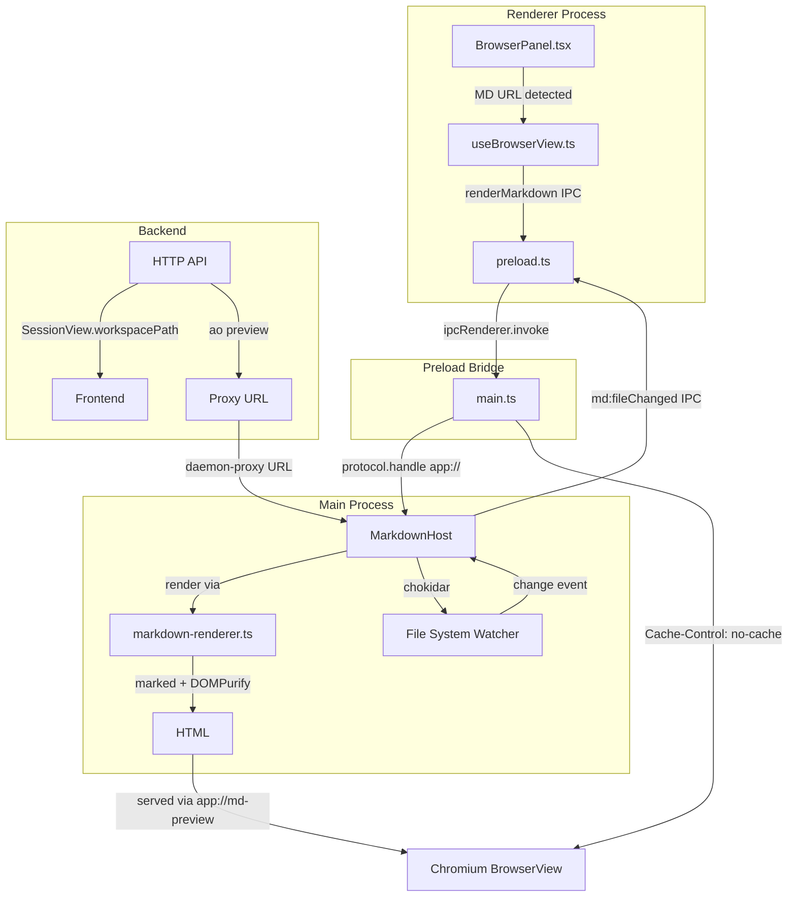
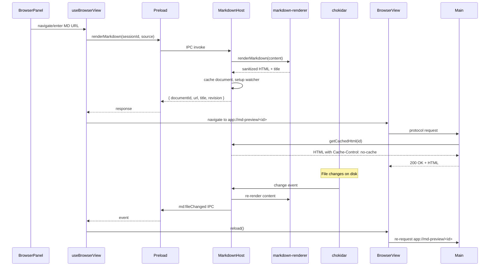

# Markdown Preview in Browser Panel — Implementation

PR [#2387](https://github.com/AgentWrapper/agent-orchestrator/pull/2387) adds the ability to render `.md` files as styled HTML inside the Electron browser panel, with file-watching for live refresh. This document explains the architecture, all changes, and known merge conflicts.

---

## Motivation

Before this PR, the browser panel could only navigate to HTTP/HTTPS/file URLs. Agents producing markdown output (reports, specs, summaries) had no way to preview it within the Electron UI. The implementation solves two problems:

1. **Chromium caching:** The `app://md-preview` custom protocol response was being cached by Chromium — after a file change, `reload()` served stale HTML instead of re-invoking the protocol handler.
2. **Daemon proxy URLs:** When markdown files were served through the daemon proxy (`http://host/api/v1/sessions/<id>/preview/files/<entry>`), the `resolveLocalPath()` function only handled `file://` URLs, so chokidar watchers were never set up.

---

## Architecture Overview



---

## Data Flow



---

## Changes by Layer

### 1. Backend Go — Surface `workspacePath` via API

| File | Change | Motivation |
|---|---|---|
| `backend/internal/httpd/controllers/dto.go` | Added `WorkspacePath string` field to `SessionView` struct | Frontend needs the session worktree path to resolve daemon-proxied file URLs to local paths |
| `backend/internal/httpd/controllers/sessions.go` | Populated `WorkspacePath` from `s.Metadata.WorkspacePath` in `sessionView()` | Extract the curated field from the hidden metadata |
| `backend/internal/httpd/controllers/sessions_test.go` | Removed negative assertion `"list leaked workspacePath"` | `workspacePath` is now a curated field (not leaked metadata), so the assertion is obsolete |
| `backend/internal/httpd/apispec/openapi.yaml` | Added `workspacePath: string` to SessionView schema | Keep API spec in sync with the DTO |

### 2. Backend Go — Multi-Skill System & Agent Prompting

| File | Change | Motivation |
|---|---|---|
| `backend/internal/skillassets/skillassets.go` | Refactored from single-embed to multi-embed; renamed `SkillName` → `UsingAoName`; added `MarkdownPreviewName`; added `DirFor()` helper | Previously only the `using-ao` skill was embedded. Now any number of skills can coexist under `skills/`. |
| `backend/internal/skillassets/skillassets_test.go` | Updated test to verify both skills are installed; clobber test uses the common parent `skills/` | |
| `backend/internal/session_manager/manager.go` | Added `aoMarkdownPreviewPointer()` appended to every agent system prompt | Agents need to know they can produce `.md` output for the browser panel |

**Embedded skill structure:**
```
<dataDir>/skills/
├── using-ao/
│   ├── SKILL.md
│   └── commands/
└── markdown-preview/
    └── SKILL.md
```

### 3. Frontend — New Shared Types

**`frontend/src/shared/markdown-types.ts`** — Type definitions consumed by both main and renderer:

| Type | Purpose |
|---|---|
| `MarkdownSourceKind` | `"file" \| "virtual" \| "url"` — discriminator for source variants |
| `MarkdownSource` | Union type: `file` (local path), `virtual` (inline content), `url` (remote/daemon-proxy URL) |
| `MarkdownDocument` | In-memory document with rendered HTML, revision counter, timestamps |
| `RenderMarkdownRequest` | IPC request payload: sessionId + source + optional workspacePath |
| `RenderMarkdownResponse` | IPC response: documentId + url + title + revision |
| `MarkdownUpdateEvent` | Event pushed to renderer when file-backed MD changes on disk |
| `MarkdownIpcChannels` | Channel name constants: `md:fileChanged`, `md:stateChanged` |
| `MARKDOWN_FILE_RE` | Regex `/\.md$/i` — used to detect markdown URLs |

### 4. Frontend Main Process — Markdown Rendering Pipeline

#### Why a custom protocol? (Why not just render MD → HTML in the BrowserView?)

A `<BrowserView>` can only navigate to **URLs** — you cannot call `setInnerHTML` on it. The options for getting rendered HTML into it:

| Approach | Problems |
|---|---|
| `data:text/html,...` | Fragile, limited size, no streaming, breaks back/forward, no cache control |
| `file:///tmp/foo.html` | Temp file cleanup, no dynamic cache busting, filesystem race conditions |
| `app://md-preview/<id>` | Clean, no temp files, full `Cache-Control` support, standard Electron idiom |

Browsers render `.md` files as **unstyled plain text** (monospace, no formatting). To get styled output (headings, code blocks, syntax highlighting, dark mode), the parser (`marked` + `DOMPurify`) runs in the main process, and the result is served on-demand via a `protocol.handle("app", ...)` handler that routes `app://md-preview/*` to `MarkdownHost.getCachedHtml()`. This is the canonical Electron pattern for serving dynamic content to a webview — not overengineering.

#### `markdown-renderer.ts` (new)

The rendering pipeline:

```
Raw MD Text
    │
    ▼
marked.parse(source)        ──→ raw HTML with tags
    │
    ▼
DOMPurify.sanitize(html)    ──→ safe HTML (allowlisted tags/attrs only)
    │
    ▼
HTML_TEMPLATE.replace()     ──→ full page with CSP + dark-mode styles
    │
    ▼
Final HTML string
```

Key design decisions:
- **`marked`** for markdown parsing (lightweight, fast, no native deps)
- **`DOMPurify`** running on a **`linkedom`** window (not `jsdom`) — minimal DOM implementation, avoids heavy jsdom dependency. `jsdom` was moved from `dependencies` to `peer`/`optional` in package.json.
- **Strict CSP**: `script-src 'none'` prevents any JS execution, even if DOMPurify has a bypass
- **`extractTitle()`** extracts first `<h1>` content for the page title
- Dark/light mode via `prefers-color-scheme` media query

#### `markdown-host.ts` (new)

Document lifecycle and file watching:

| Method | Purpose |
|---|---|
| `render(request)` | Handle all three source kinds: file, virtual, url |
| `destroy(documentId)` | Remove a single document and its watchers |
| `destroySession(sessionId)` | Clean up all documents for a terminated session |
| `dispose()` | Teardown all watchers, documents, timers |
| `getCachedHtml(documentId)` | Serve cached HTML to the protocol handler |

File watching flow:
```
chokidar.watch(filePath)
    │
    ├── awaitWriteFinish: { stabilityThreshold: 300ms }
    │
    └── on "change" →
        debounce 300ms →
        readFile → renderMarkdown() →
        IPC md:fileChanged to renderer →
        renderer calls reload()
```

Daemon proxy URL resolution (`resolveLocalPath`):
- Parses `/api/v1/sessions/<id>/preview/files/<entry>` via regex
- Joins `<entry>` against `workspacePath`
- Guards against directory traversal: rejects if resolved path is outside `workspacePath`

#### `main.ts` — Consolidated `app://` Protocol Handler

Before: Separate `registerRendererProtocol()` for `app://renderer/*` only.

After: Single `protocol.handle("app", ...)` that routes:
```
app://renderer/*   → registerRendererProtocolInner() (SPA)
app://md-preview/* → markdownHost.getCachedHtml(id) + Cache-Control headers
```

**Cache-Control fix** (commit `c74044e`):
```
Cache-Control: no-cache, no-store, must-revalidate
Pragma: no-cache
Expires: 0
```
These headers prevent Chromium from caching the protocol response. When `reload()` is called after a file change, the protocol handler is re-invoked and returns fresh HTML.

MarkdownHost lifecycle is wired to `app.whenReady()` and `app.on("before-quit")`.

#### `browser-view-host.ts`

Added `"app:"` to `ALLOWED_PROTOCOLS`:

```diff
- const ALLOWED_PROTOCOLS = new Set(["http:", "https:", "file:"]);
+ const ALLOWED_PROTOCOLS = new Set(["http:", "https:", "file:", "app:"]);
```

The `app://renderer` origin is still blocked via the `isAllowedBrowserURL` check — only `app://md-preview` URLs are valid browser targets.

### 5. Frontend Preload Bridge

**`preload.ts`** — Two new API methods exposed to the renderer:

| Method | IPC Channel | Direction |
|---|---|---|
| `browser.renderMarkdown(sessionId, source, workspacePath?)` | `browser:renderMarkdown` (invoke/handle) | Renderer → Main |
| `browser.onMarkdownFileChanged(listener)` | `md:fileChanged` (on/off) | Main → Renderer |

### 6. Frontend Renderer

#### `hooks/useBrowserView.ts`

Key additions:
- **`renderMarkdown(source)`** — calls preload bridge, navigates view to `app://md-preview/<id>`, stores `currentDocIdRef`
- **`onMarkdownFileChanged` effect** — listens for file change events; if the event's `documentId` matches `currentDocIdRef`, calls `reload()` on the browser view
- **`previewUrl` effect updated** — when the daemon pushes a new preview URL that matches `MARKDOWN_FILE_RE`, it routes through `renderMarkdown()` instead of `navigate()`

#### `components/BrowserPanel.tsx`

- Receives `workspacePath` from session
- On form submit, normalises bare absolute paths (`/foo/bar.md` → `file:///foo/bar.md`) so MarkdownHost detects them as local files
- If the URL matches `MARKDOWN_FILE_RE`, calls `browserView.renderMarkdown()` instead of `navigate()`

#### `components/SessionView.tsx`

- Passes `workspacePath` to `useBrowserView()`

#### `hooks/useWorkspaceQuery.ts`

- Added `workspacePath: session.workspacePath` in the session mapper

#### `types/workspace.ts`

- Added `workspacePath?: string` to `WorkspaceSession`

#### Test stubs

`bridge.ts`, `test/setup.ts`, `useBrowserView.test.tsx` — all updated with stub `renderMarkdown` and `onMarkdownFileChanged` to prevent test failures.

### 7. Dependencies

| Package | Version | Purpose |
|---|---|---|
| `marked` | ^15.0.11 | Markdown → HTML parser |
| `dompurify` | ^3.2.4 | HTML sanitisation |
| `linkedom` | ^0.18.12 | Lightweight DOM for DOMPurify (replaces jsdom) |
| `chokidar` | ^5.0.0 | OS-native file watching |
| ~~`jsdom`~~ | removed | No longer needed (replaced by linkedom) |

---

## Merge Conflict with `origin/main`

There is **one conflict** in `frontend/src/renderer/hooks/useWorkspaceQuery.ts`:

```
<<<<<<< .our (origin/main)
    activity: toSessionActivity(session.activity),
=======
    workspacePath: session.workspacePath,
>>>>>>> .their (fix/markdown-preview-cache)
```

### Root Cause

Both branches add a field to the same session mapper object at the same position (between `updatedAt` and `previewUrl`):

| Branch | Field Added | Feature |
|---|---|---|
| `origin/main` (PR #2325) | `activity: toSessionActivity(session.activity)` | Tracker intake — GitHub issue-to-session lifecycle |
| `fix/markdown-preview-cache` (PR #2387) | `workspacePath: session.workspacePath` | Markdown preview — daemon proxy URL file watching |

### Resolution

Keep **both** fields — they are independent and non-overlapping:

```typescript
updatedAt: session.updatedAt,
activity: toSessionActivity(session.activity),
workspacePath: session.workspacePath,
previewUrl: session.previewUrl,
```

The `workspace.ts` type file has no conflict — `origin/main` adds `activity` and `issueId` fields, `fix/markdown-preview-cache` adds `workspacePath` — they are at different positions in the type.

No other files have merge conflicts — the remaining 24 files were changed only on the `fix/markdown-preview-cache` branch.

---

## Post-PR Improvement: Arbitrary File Path Support

After PR #2387, users can only open markdown files that are either `file://` URLs, `/`-prefixed absolute paths, or daemon-proxy URLs. Paths in Windows UNC format (`\\wsl.localhost\…`) or with drive letters (`C:\…`) fail because:

1. `BrowserPanel.tsx` only converted `/`-prefixed paths to `file://`
2. `markdown-host.ts` `resolveLocalPath()` had no fallback for unrecognised path formats

### Changes

#### `BrowserPanel.tsx` — Broader path normalisation

The single `startsWith("/")` check was replaced with three branches:

| Input Pattern | Example | Conversion | Notes |
|---|---|---|---|
| `\\` or `//` prefix | `\\wsl.localhost\Ubuntu\file.md` | `file:////wsl.localhost/Ubuntu/file.md` | UNC path — uses 4 slashes (`file:////`) which `fileURLToPath` decodes back to `\\host\share\…` on Windows |
| `/` or `\` prefix | `/home/user/file.md` | `file:///home/user/file.md` | Unix absolute or backslash-prefixed paths |
| `[A-Za-z]:` prefix | `C:\Users\user\file.md` | `file:///C:/Users/user/file.md` | Windows drive letter — uses 3 slashes (`file:///`) which is the standard `file:///C:/…` form |

Backslashes are converted to forward slashes in all cases.

#### `markdown-host.ts` — Filesystem fallback in URL handler

After `resolveLocalPath()` returns null, a new helper `tryLocalFile()` attempts direct filesystem access:

```
source.kind === "url"
    │
    ├─ resolveLocalPath(url, workspacePath)  ── success → readFile + watcher
    │
    ├─ tryLocalFile(url)                      ── success → readFile + watcher
    │    │
    │    └─ Skips if URL matches ^https?:// (defers to fetch)
    │    └─ Strips file:// prefix + normalizes backslashes
    │    └─ existsSync check
    │
    └─ fetch(url)                             ── HTTP fallback
```

This catches edge cases where `fileURLToPath` produces a path the platform rejects (e.g., UNC path on Linux), or where the `BrowserPanel` normaliser didn't convert the input.

### Path Resolution Table

| User Input | `BrowserPanel.tsx` output | `resolveLocalPath` result | `tryLocalFile` result | Works? |
|---|---|---|---|---|
| `/home/user/file.md` | `file:///home/user/file.md` | `fileURLToPath` → `/home/user/file.md` → exists | — | ✅ |
| `\\wsl.localhost\…\file.md` | `file:////wsl.localhost/…/file.md` | `fileURLToPath` → `\\wsl.localhost\…\file.md` → depends on OS | skips (already matched `file://`) | ✅ on Windows, ❌ on Linux |
| `C:\Users\…\file.md` | `file:///C:/Users/…/file.md` | `fileURLToPath` → `C:\Users\…\file.md` → depends on OS | skips (already matched `file://`) | ✅ on Windows, ❌ on Linux |
| `/api/v1/sessions/…/preview/files/entry.md` | unchanged | `parseDaemonProxyEntry` → resolved via workspacePath | — | ✅ |
| `https://example.com/doc.md` | unchanged | null (no match) | skipped (HTTP scheme) | ✅ via fetch |
| `raw/backslash/path.md` (no prefix, no scheme) | unchanged | null | `existsSync` check → read + watch | ✅ if file exists |

## Summary

```mermaid
flowchart LR
    subgraph "Problem 1: Chromium Cache"
        A1[browser reload()] -->|stale cached HTML| A2[❌ No re-render]
        A1 -->|Cache-Control headers| A3[✅ Fresh HTML]
    end

    subgraph "Problem 2: Daemon Proxy URLs"
        B1[proxy URL like\n/api/v1/sessions/...] --> B2[resolveLocalPath\nonly handled file://]
        B2 --> B3[❌ No watcher setup]
        B1 --> B4[parseDaemonProxyEntry\n+ workspacePath]
        B4 --> B5[✅ Watcher on local file]
    end

    subgraph "Feature: MD Preview"
        C1[.md file detected] --> C2[renderMarkdown IPC]
        C2 --> C3[marked + DOMPurify]
        C3 --> C4[app://md-preview/<id>]
        C4 --> C5[chokidar watches file]
        C5 -->|change| C6[auto-reload]
    end
```

---

## Post-PR Fix: CLI Relative Path Resolution

When the user runs `ao preview README.md` from the worktree directory, the raw relative path `"README.md"` was sent to the daemon verbatim. The daemon's `resolvePreviewTarget` tried to resolve it against the session's `WorkspacePath` via `resolveLocalPreview` → `confinedPreviewPath`, but when the user's CWD didn't match the session's stored workspace path (or for any other reason the file wasn't found at `workspacePath/README.md`), the function returned false and the daemon persisted the bare string `"README.md"` as the `preview_url`.

On the Electron side, `MarkdownHost.resolveLocalPath("README.md")` failed to match any known pattern:
- Not a `file://` URL (no `file://` prefix)
- Not a daemon-proxy URL (no `/api/v1/sessions/.../preview/files/...` pattern)
- Not an HTTP URL (no scheme)

The fallback `tryLocalFile("README.md")` also failed because the Electron main process's CWD is not the worktree directory. The browser panel stored the URL but never rendered anything — a silent failure.

### Changes

| File | Change | Motivation |
|---|---|---|
| `backend/internal/cli/preview.go` | Added `path/filepath` import; resolved bare relative paths to absolute in `openPreview()` | The daemon already handles absolute paths via `absolutePreviewFileURL` (stats the file, converts to `file://` URL), and Electron's `resolveLocalPath` handles `file://` URLs correctly. |
| `backend/internal/cli/preview.go` | Updated `Long`/`Example` to show relative path support | The existing help text only showed `file://$(pwd)/...` as a workaround; relative paths now work directly. |
| `backend/internal/cli/preview_test.go` | Added `TestPreview_RelativePathResolvedToAbsolute` + `TestPreview_RelativePathNonExistentPassedThrough` | Verify that existing files are resolved to absolute paths and non-existent files pass through unchanged. |

### Resolution flow

```
Terminal: ao preview README.md
    │ (CWD = ~/.ao/data/worktrees/dummy/dummy-56/)
    │
    ├── CLI: openPreview("README.md")
    │     ├── filepath.IsAbs("README.md")             → false
    │     ├── filepath.Abs("README.md")               → "/home/.../dummy-56/README.md"
    │     ├── os.Stat("/home/.../dummy-56/README.md")  → exists
    │     └── target = "/home/.../dummy-56/README.md"  (absolute path)
    │
    ├── POST {"url":"/home/.../dummy-56/README.md"}   → daemon
    │
    ├── Daemon: resolvePreviewTarget(...)
    │     ├── isAbsolutePreviewPath("/home/.../README.md")    → true
    │     ├── absolutePreviewFileURL("/home/.../README.md")
    │     │     ├── os.Stat → exists
    │     │     └── returns "file:///home/.../dummy-56/README.md"
    │     └── persistence: SQLite stores file:// URL
    │
    ├── CDC trigger → SSE → Electron
    │
    └── Electron: BrowserPanel detects .md → renderMarkdown()
          └── MarkdownHost.resolveLocalPath("file:///home/.../README.md")
                ├── file:// prefix detected
                ├── fileURLToPath → "/home/.../dummy-56/README.md"
                ├── fs.exists → found
                ├── read → marked + DOMPurify → HTML
                ├── chokidar watcher on path
                └── navigate to app://md-preview/<id> ✅
```

### Design decisions

- **Stat before resolving**: The `os.Stat` guard prevents converting `localhost:5173` or other non-file arguments into absolute paths. Only if the relative path points at an existing file on disk is the conversion performed.
- **Pass-through for non-existent files**: When the relative path doesn't exist, the CLI sends the original string verbatim and the daemon's existing fallback path applies (it will either find it via `resolveLocalPreview` against `WorkspacePath`, or persist the raw string and let Electron fail).
- **No Electron-side change**: The fix is entirely in the CLI. The daemon's `absolutePreviewFileURL` already converts absolute paths to `file://` URLs, and Electron's `resolveLocalPath` already handles `file://` URLs correctly — the missing link was that relative paths never became absolute before hitting the wire.

### Path Resolution Table (updated)

| User Input | CLI preprocessing | Daemon receives | Electron resolves | Works? |
|---|---|---|---|---|
| `README.md` | → `/abs/path/README.md` (stat) | `/abs/path/README.md` → `file:///abs/path/README.md` | `fileURLToPath` → read + watch | ✅ |
| `./dist/index.html` | → `/abs/path/dist/index.html` (stat) | `/abs/path/dist/index.html` → `file:///abs/path/dist/index.html` | `fileURLToPath` → read + watch | ✅ |
| `nonexistent.md` | unchanged (stat fails) | `"nonexistent.md"` → falls through daemon's `resolveLocalPreview` vs `WorkspacePath` | depends on workspace match | ⚠️ (unchanged behavior) |
| `localhost:5173` | unchanged (stat fails) | verbatim (daemon treats as host:port) | `tryLocalFile` fails → `fetch` | ✅ via HTTP |
| `/absolute/path.md` | unchanged (already absolute) | daemon's `absolutePreviewFileURL` → `file://` | `file://` → read + watch | ✅ |
| `http://example.com/doc.md` | unchanged (no `filepath.IsAbs` hit) | verbatim | `fetch` via HTTP | ✅ |

---

## Post-PR Feature: CSS-Only Dark/Light Theme Toggle

After PR #2387, rendered markdown pages used a `@media (prefers-color-scheme: dark)` query to auto-detect the system theme. There was no manual toggle — users whose system was in light mode could not switch the preview to dark mode, and vice versa.

The fix adds a clickable sun/moon toggle button in the top-right corner of every rendered markdown page, using a **CSS-only checkbox hack** that requires zero JavaScript and fully respects the `script-src 'none'` CSP.

### How it works

A hidden `<input type="checkbox" id="theme-toggle">` sits before the content `<div>` inside `<body>`. A `<label for="theme-toggle">` styled as a 34px frosted-glass circle is fixed to the top-right corner. Clicking the label toggles the checkbox, and CSS adjacent-sibling selectors swap all color properties:

```
Checkbox unchecked (default)             Checkbox checked
       │                                        │
       ▼                                        ▼
#theme-toggle:not(:checked)             #theme-toggle:checked
  ~ .content { color, borders }          ~ .content { color, borders }
  body:has(...) { background }           body:has(...) { background }
       │                                        │
       ▼                                        ▼
   Light theme ☀                           Dark theme ☾
```

The label's `::after` pseudo-element shows `☾` when in light mode (click to go dark) and `☀` when in dark mode (click to go light), using the CSS-only content swap:

```css
.theme-toggle-label::after { content: "\263E"; }
#theme-toggle:checked + .theme-toggle-label::after { content: "\2600"; }
```

### Full-viewport background fix

The initial implementation had the background color on the `.content` div, which has `max-width: 920px; margin: 0 auto`. When toggling to dark mode, the body's default white background was visible on either side of the centered content column — a white border.

Fixed by moving the background to `<body>` via the `:has()` selector (Chromium 130+, Electron 33):

```css
body:has(#theme-toggle:not(:checked)) { background: #ffffff; }
body:has(#theme-toggle:checked) { background: #1a1a1a; }
body { transition: background 0.25s; }
```

This paints the background behind the full viewport regardless of the `.content` div's centering.

### Changes

| File | Change | Motivation |
|---|---|---|
| `frontend/src/main/markdown-renderer.ts` | Replaced `@media (prefers-color-scheme: dark)` theme with CSS-only checkbox toggle | Give users manual light/dark control without violating `script-src 'none'` CSP |
| `frontend/src/main/markdown-renderer.ts` | Moved background from `.content` to `body:has()` | Fix white border visible outside `.content`'s `max-width` bounds |

No other files changed — no new IPC channels, no new types, no changes to the host, renderer, or browser view. The toggle is entirely self-contained within each rendered HTML page.

### CSP compatibility

The toggle relies on three features that the strict CSP already allows:

| Feature | CSP directive | Status |
|---|---|---|
| `<label for="...">` | HTML, no CSP restriction | ✅ Always allowed |
| `:checked`, `:not(:checked)` pseudo-classes | CSS, no CSP restriction | ✅ `style-src 'unsafe-inline'` |
| `:has()` parent selector | CSS, no CSP restriction | ✅ `style-src 'unsafe-inline'` |

No changes to the CSP policy were needed.

---

## Post-PR Feature: File Deletion Handling & Agent Auto-Preview Instructions

After the initial markdown preview implementation, two gaps were identified in the user workflow:

1. **File deletion left stale content**: When a watched `.md` file was deleted from disk, the chokidar watcher fired an `unlink` event that was not handled. The browser panel continued displaying the old rendered HTML with no indication the file was gone.

2. **Agent workflow required manual `ao preview`**: The SKILL.md instructed agents to "tell the user the path", requiring the user to manually open the file. Agents could not proactively push the preview to the panel.

### File deletion handling

**`frontend/src/main/markdown-host.ts`** — The chokidar watcher already handled `change` and `error` events, but `unlink` (file deletion) was unhandled. A new `onFileDeleted()` method was added:

```
chokidar.watch(filePath)
    │
    ├── "change"  → onFileChanged()   → re-read + re-render + IPC
    ├── "unlink"  → onFileDeleted()   → render deletion notice + IPC + close watcher
    └── "error"   → console.error
```

The `onFileDeleted` method:
- Removes all documents referencing the deleted path from the cache (so `getCachedHtml` returns `null`)
- Closes the chokidar watcher for that path
- Makes an HTTP `DELETE /api/v1/sessions/{id}/preview` call to the daemon

The daemon's `clearPreview` handler (DELETE endpoint) was updated to autodetect `index.html` in the workspace before clearing. If `index.html` exists, the preview reverts to it. If not, the preview URL is cleared and the browser panel shows its blank initial state. No error page or deletion notice is shown.

### Agent auto-preview instructions

**`backend/internal/skillassets/markdown-preview/SKILL.md`** — The "Using from a session" section was expanded with new steps:

| Step | Instruction | Rationale |
|---|---|---|
| 2 | After creating a `.md` file, run `ao preview <path>` immediately | The user sees rendered output without manual steps |
| 3 | If producing multiple `.md` files, only auto-preview the **last** one | The panel can show only one at a time; previous targets are replaced instantly |

The agent's system prompt already had the `aoMarkdownPreviewPointer()` appended (from the earlier multi-skill work), which tells agents to read this SKILL.md file. No changes to `session_manager/manager.go` were needed.

### Changes

| File | Change | Motivation |
|---|---|---|
| `frontend/src/main/markdown-host.ts` | Added `unlink` handler + `onFileDeleted()` method that deletes the cached doc and calls daemon to revert | Browser panel reverts to `index.html` or blank — no stale content, no error page |
| `frontend/src/main/markdown-host.ts` | Added `setDaemonPort()` method | MarkdownHost needs the daemon port to make DELETE calls |
| `frontend/src/main.ts` | Calls `markdownHost.setDaemonPort(port)` from `reportBoundPort` | Wires the daemon port into MarkdownHost when it's confirmed |
| `backend/internal/httpd/controllers/sessions.go` | Updated `clearPreview` (DELETE) to autodetect `index.html` before clearing | When a file-backed preview is deleted, the daemon reverts to the default entry point instead of showing stale content |
| `backend/internal/skillassets/markdown-preview/SKILL.md` | Expanded with auto-preview steps; documented file deletion behavior | Agents can proactively push previews without manual user action |
